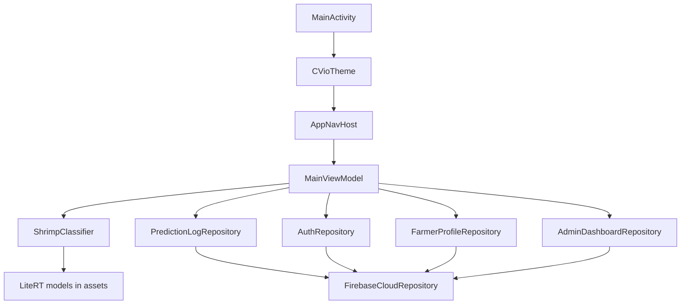
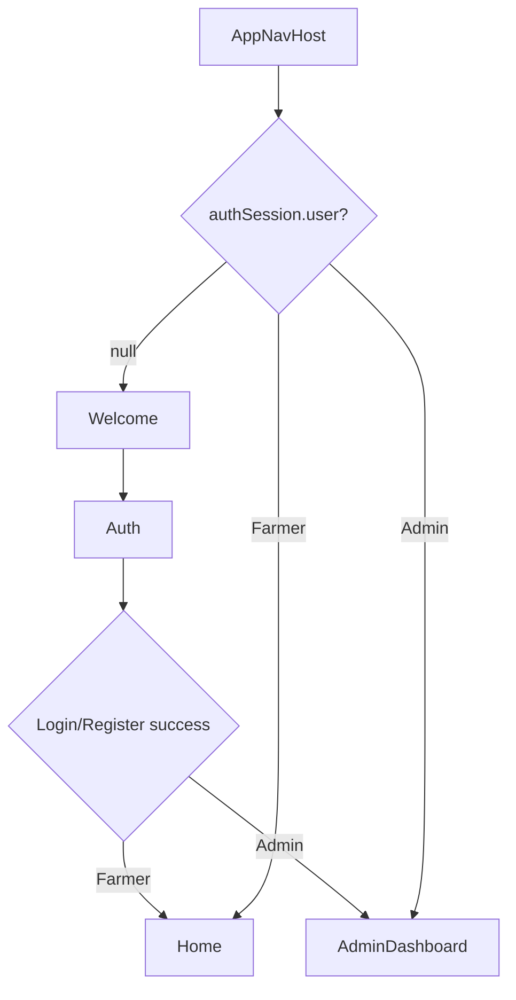
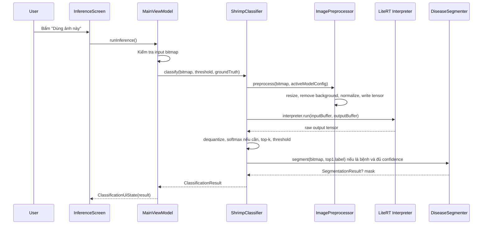
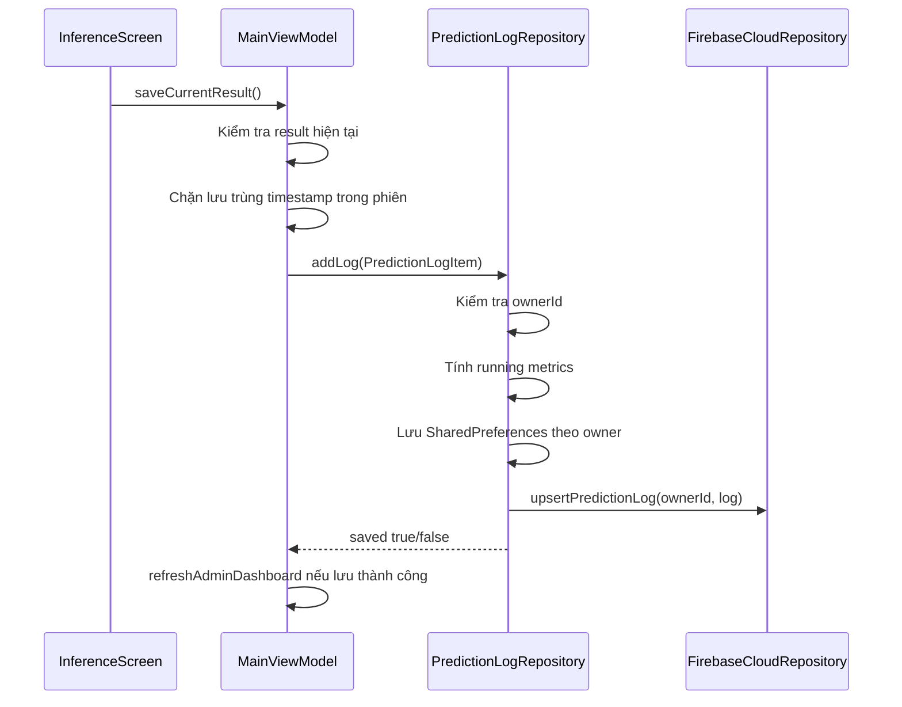
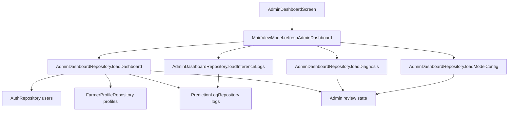
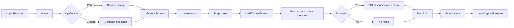
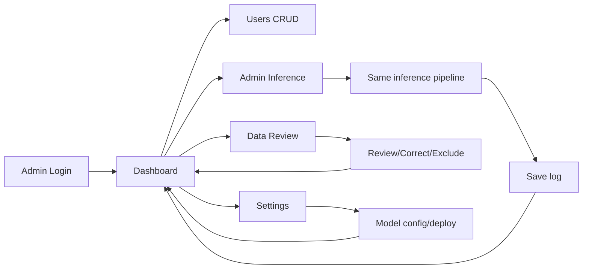

# CVio Android - Flow xử lý của app

Tài liệu này mô tả luồng xử lý chính của app Android trong thư mục `LiteRT-for-Android`, dựa trên mã nguồn hiện tại. App dùng Kotlin, Jetpack Compose, Hilt, CameraX, LiteRT/TensorFlow Lite, Firebase Auth và Firestore.

## 1. Tổng quan kiến trúc

CVio là app kiểm tra bệnh tôm chạy inference trực tiếp trên thiết bị. App nhận ảnh từ thư viện hoặc camera, tiền xử lý ảnh, chạy model `.tflite`, hậu xử lý kết quả, tùy chọn tạo mask vùng bệnh, rồi cho phép lưu lịch sử và đồng bộ metadata lên Firebase nếu backend được cấu hình.

Các khối chính:

- UI layer: Compose screens trong `ui/` và `navigation/AppNavHost.kt`.
- State layer: `MainViewModel.kt` gom state cho inference, auth, profile, history, admin.
- AI layer: `classifier/ShrimpClassifier.kt`, `ImagePreprocessor.kt`, `BackgroundRemover.kt`, `DiseaseSegmenter.kt`.
- Data layer: `PredictionLogRepository.kt`, `AuthRepository.kt`, `FarmerProfileRepository.kt`, `AdminDashboardRepository.kt`.
- Cloud layer: `FirebaseCloudRepository.kt`.
- Assets: model và label trong `app/src/main/assets/`.

## 2. Entry point và khởi tạo app

1. Android mở `MainActivity` từ `AndroidManifest.xml`.
2. `MainActivity.onCreate()` gọi `enableEdgeToEdge()` và render Compose:
   - `CVioTheme`
   - `AppNavHost()`
3. `LiteRtApplication` được đánh dấu `@HiltAndroidApp`, vì vậy Hilt tạo dependency graph cho toàn app.
4. `ImageClassifierModule` provide `AssetManager` từ `ApplicationContext`.
5. `ShrimpClassifier` là singleton. Khi được inject, nó load model mặc định ngay trong `init`.

Model mặc định và runtime default nằm ở `classifier/ModelConfig.kt`:

- Classification model mặc định: `yolo26m_asl_ldam_simam_dcfr_fp32.tflite`
- Label file: `labels.txt`
- Background remover: `u2net_dynamic_range_int8.tflite`
- Disease segmentation model: `yolo11n_seg_float16.tflite`
- Segmentation label file: `seg_labels.txt`
- Thread: `4`
- Threshold mặc định: `0.50`
- XNNPACK: bật
- NNAPI: tắt

## 3. Điều hướng theo session và role

`AppNavHost` quan sát `authSession` từ `MainViewModel.authSession`.

Start destination:

- Chưa đăng nhập: `Welcome`
- Role `Farmer`: `Home`
- Role `Admin`: `AdminDashboard`

Top-level screens:

- Farmer: `Home`, `Inference`, `History`, `Profile`
- Admin: `AdminDashboard`, `AdminUsers`, `AdminInference`, `AdminData`, `Settings`

Khi session thay đổi, `MainViewModel.init` thực hiện:

1. Xóa cache chống lưu trùng kết quả inference trong phiên hiện tại.
2. Gọi `PredictionLogRepository.setOwner(user.id)` để load logs theo user.
3. Gọi `FarmerProfileRepository.setUser(user)` để load profile.
4. Gọi `refreshAdminDashboard()` để admin state luôn mới khi role/session đổi.

## 4. Flow đăng nhập và đăng ký

UI gọi `AuthScreen`, sau đó callback về `AppNavHost`:

- `onLogin(account, password)` -> `MainViewModel.login()`
- `onRegister(account, password)` -> `MainViewModel.register()`

`AuthRepository` xử lý theo thứ tự:

1. Chuẩn hóa account bằng `trim().lowercase()`.
2. Validate account không rỗng, password tối thiểu 6 ký tự.
3. Thử refresh danh sách user từ Firestore.
4. Nếu Firebase khả dụng và account là email:
   - Login bằng Firebase Auth.
   - Register bằng Firebase Auth.
   - Upsert user metadata vào collection `users`.
5. Nếu Firebase không khả dụng:
   - Debug build cho phép fallback local auth bằng SharedPreferences.
   - Release build tắt local fallback theo `BuildConfig.ALLOW_LOCAL_AUTH_FALLBACK = false`.
6. Lưu session user id vào SharedPreferences.
7. Phát `AuthSession(user)` để UI điều hướng.

Debug build có thể seed default admin nếu `CVIO_DEFAULT_ADMIN_PASSWORD` được cấu hình. Release build không seed admin mặc định.

## 5. Flow Farmer: chọn ảnh hoặc chụp ảnh

### 5.1 Chọn ảnh từ thư viện

1. User bấm chọn ảnh ở `HomeScreen` hoặc `InferenceScreen`.
2. `AppNavHost` mở `ActivityResultContracts.GetContent()` với MIME `image/*`.
3. Khi URI trả về:
   - `BitmapUtils.decodeBitmapFromUri(context, uri)` decode ảnh bằng `ImageDecoder`.
   - Nếu cạnh dài lớn hơn `1280`, ảnh được scale xuống để giảm bộ nhớ.
4. `MainViewModel.setGalleryImage(uri, bitmap)`:
   - Reset ground truth label.
   - Cập nhật `InferenceInputUiState(imageUri, bitmap, source = GALLERY)`.
   - Tắt camera active.
   - Clear kết quả cũ.
5. Điều hướng sang `Inference` hoặc `AdminInference` tùy role.

### 5.2 Chụp ảnh bằng camera

1. User bấm mở camera.
2. Nếu chưa có quyền camera, `AppNavHost` request `Manifest.permission.CAMERA`.
3. Khi được cấp quyền:
   - `MainViewModel.startCameraInput()`
   - Điều hướng sang màn inference.
4. `InferenceScreen` render `CameraCaptureCard`.
5. `CameraCaptureCard` dùng CameraX:
   - `Preview` để hiển thị camera.
   - `ImageAnalysis` với `OUTPUT_IMAGE_FORMAT_RGBA_8888`.
   - Backpressure `STRATEGY_KEEP_ONLY_LATEST`.
   - Resolution target gần `ModelDefaults.INPUT_SIZE` là `224x224`.
6. Mỗi frame được chuyển thành `Bitmap` bằng `imageProxyToBitmap()`:
   - Copy RGBA buffer.
   - Crop phần row padding nếu có.
   - Rotate theo `imageInfo.rotationDegrees`.
7. Frame mới nhất được giữ trong `AtomicReference<Bitmap?>`.
8. Khi user bấm chụp:
   - Copy latest frame.
   - `MainViewModel.setCameraSnapshot(bitmap)` cập nhật input state.

Camera FPS không chạy inference liên tục. `MainViewModel.recordCameraFrame()` chỉ đếm frame để hiển thị FPS camera.

## 6. Flow inference chính

Inference chỉ chạy khi user bấm nút dùng ảnh hiện tại. App không tự động classify mỗi frame camera.

### 6.1 Validate input

`MainViewModel.runInference()` lấy `inputState.bitmap`.

- Nếu chưa có bitmap, ViewModel phát lỗi: cần chọn hoặc chụp ảnh trước khi kiểm tra.
- Nếu có bitmap, ViewModel set `ClassificationUiState(isLoading = true)` và chạy inference trên `Dispatchers.Default`.

### 6.2 Load và quản lý model

`ShrimpClassifier.initializeFromAssets()`:

1. Memory-map file `.tflite` bằng `AssetManager.loadModelFile()`.
2. Tạo `InterpreterApi` với options:
   - `setNumThreads(4)`
   - `setUseNNAPI(false)`
   - `setUseXNNPACK(true)`
3. `allocateTensors()`.
4. Đọc input/output tensor.
5. Resolve input layout:
   - `NHWC` nếu shape `[1, H, W, 3]`
   - `NCHW` nếu shape `[1, 3, H, W]`
6. Resolve input width/height từ tensor thật, không chỉ dựa vào default `224`.
7. Allocate direct `ByteBuffer` cho input/output.
8. Load labels từ `labels.txt`.
9. Kiểm tra số label phải bằng số output class. Nếu lệch, app throw lỗi để tránh sai thứ tự class.
10. Tạo `ModelInfo` để UI debug/settings hiển thị tensor metadata.

Đổi model ở runtime:

1. User chọn model trong Settings hoặc admin deploy model.
2. `MainViewModel.loadModel(modelFile)`.
3. `ShrimpClassifier.loadModelFromAssets()`.
4. Chỉ replace interpreter cũ sau khi interpreter mới đã load thành công.
5. Đóng interpreter cũ.
6. Cập nhật `modelInfo`, `labels`, `availableModels`.

GPU delegate hiện chưa được bật. Nếu user chọn GPU, `MainViewModel.setRuntimeDelegate()` báo lỗi và tiếp tục dùng CPU.

### 6.3 Tiền xử lý ảnh

`ImagePreprocessor.preprocess()` nhận `Bitmap` và `ModelConfig`, sau đó ghi trực tiếp vào `inputBuffer`.

Các bước:

1. Reset vị trí buffer bằng `rewind()`.
2. Resize ảnh về `inputWidth x inputHeight`.
3. Tách nền:
   - Ưu tiên `BackgroundRemover` dùng model U2Net/rembg.
   - Nếu model U2Net không load được hoặc chạy lỗi, fallback sang `EdgeBackgroundRemover`.
4. Chuẩn hóa pixel theo model family:
   - `YOLO_ULTRALYTICS`: RGB chia `255.0`, giá trị `0..1`.
   - `PYTORCH_IMAGENET`: RGB chia `255.0`, sau đó normalize bằng ImageNet mean/std.
5. Ghi tensor theo layout:
   - `NHWC`: từng pixel ghi R, G, B.
   - `NCHW`: ghi toàn bộ kênh R, rồi G, rồi B.
6. Ghi dtype:
   - `FLOAT32`: `putFloat(value)`.
   - `UINT8` hoặc `INT8`: quantize bằng scale và zero point của input tensor.
7. Nếu bật debug info, log min/max/mean và một số giá trị đầu vào.

### 6.4 Chạy model LiteRT

`ShrimpClassifier.classify()` đo thời gian theo 3 phần:

- `preprocessingTimeMs`
- `modelInferenceTimeMs`
- `postprocessingTimeMs`

Sau tiền xử lý:

1. `outputBuffer.rewind()`.
2. `interpreterApi.run(inputBuffer, outputBuffer)`.
3. Đọc output values theo dtype tensor.
4. Nếu output quantized, dequantize bằng output scale/zero point.

### 6.5 Hậu xử lý classification

`toProbabilities()` kiểm tra output:

- Nếu values đã giống probability hợp lệ, dùng trực tiếp.
- Nếu không, coi như logits và chạy softmax ổn định bằng max-logit.

Sau đó:

1. Sort class theo confidence giảm dần.
2. Lấy top-k theo `ModelDefaults.TOP_K = 3`.
3. Top-1 là predicted class gốc.
4. So sánh top-1 confidence với threshold hiện tại.
5. Nếu thấp hơn threshold, `predictedClass = "Unknown / Low confidence"`.
6. Nếu admin đã chọn ground truth label, tính `isCorrect = top1.label == groundTruthLabel`.
7. Tính speed và FPS từ tổng thời gian.
8. Tạo `ClassificationResult`.

Lưu ý: `ClassificationResult.rawTop1Label` vẫn giữ top-1 thật để UI có thể hiển thị khi confidence thấp.

### 6.6 Segmentation vùng bệnh

Sau classification, `ShrimpClassifier` chỉ gọi `DiseaseSegmenter.segment()` khi:

- Kết quả vượt threshold.
- Label không rỗng.
- Label không chứa `healthy`.
- Label không chứa `unknown`.
- Label không chứa `background`.

`DiseaseSegmenter` dùng model `yolo11n_seg_float16.tflite` và `seg_labels.txt`.

Flow segment:

1. Lazy-load `YoloSegmentationRunner` lần đầu cần mask.
2. Resize ảnh theo input tensor segmentation.
3. Ghi RGB `0..1` vào input buffer.
4. Chạy `runForMultipleInputsOutputs()` để lấy:
   - detection output
   - proto mask output
5. Chọn class được phép theo predicted class:
   - Predicted chứa `BG` hoặc `black` thì ưu tiên class BG.
   - Predicted chứa `WSSV` thì ưu tiên class WSSV.
   - `WSSV_BG` yêu cầu cả 2 class nếu có thể.
6. Chọn detection theo threshold, sau đó NMS theo IoU.
7. Nếu không có detection đủ mạnh:
   - Dùng fallback threshold thấp hơn.
   - Với class composite, thử threshold rất thấp cho class còn thiếu.
8. Tạo mask từ proto và mask coefficients.
9. Nếu mask rỗng:
   - Thử relaxed mask threshold.
   - Nếu vẫn rỗng, fallback sang box mask.
10. Render overlay bitmap với màu:
    - BG: xanh
    - WSSV: tím
11. Trả về `SegmentationResult(maskBitmap, label, confidence, detectionCount, classCounts)`.

UI chỉ hiển thị card mask khi kết quả là disease và vượt threshold.

## 7. Hiển thị kết quả inference

`InferenceScreen` dùng `AnimatedContent`:

- Chưa có result: `CaptureUploadContent`
- Có result: `DiagnosisResultContent`

Màn kết quả hiển thị:

- Ảnh đã kiểm tra.
- Badge trạng thái:
  - Healthy
  - Disease
  - Warning/Low confidence
- Class dự đoán và confidence.
- Báo cáo kiểm tra bằng text.
- Top-3 prediction.
- Mask vùng bệnh nếu có segmentation.
- Metrics nếu admin bật view tương ứng.
- Debug info nếu bật trong Settings.

Các action sau khi có kết quả:

- `Lưu vào lịch sử`
- `Chụp ảnh khác`
- `Chọn ảnh khác`
- Mở History hoặc Admin Logs
- Về Home/AdminDashboard

## 8. Flow lưu lịch sử prediction

Kết quả không tự lưu sau inference. User phải bấm lưu.

`MainViewModel.addResultToLog()` tạo `PredictionLogItem` gồm:

- URI ảnh nếu chọn từ thư viện.
- Thumbnail bitmap nếu ảnh đến từ camera.
- Predicted class, confidence, top-3.
- Inference time, speed, FPS.
- Model name.
- Threshold và trạng thái vượt threshold.
- Ground truth label và correctness nếu có.
- Timestamp.

`PredictionLogRepository.addLog()`:

1. Cần `ownerId`, nếu chưa login thì không lưu.
2. Đọc logs hiện có của owner.
3. Chặn trùng theo `id = timestamp`.
4. Tính benchmark metrics mới:
   - total runs
   - weekly runs
   - evaluated runs
   - correct runs
   - average inference time
   - average speed
   - average FPS
   - accuracy
5. Gắn running metrics vào log mới.
6. Lưu tối đa `200` logs gần nhất.
7. Ghi local SharedPreferences.
8. Upsert Firestore nếu Firebase khả dụng.
9. Publish lại `logs`, `benchmarkMetrics`, `historyUiState`.

## 9. Flow History và export CSV

`HistoryScreen` nhận `historyUiState` từ `PredictionLogRepository`.

Các filter:

- All
- Healthy
- Disease
- Low confidence

Logic phân loại log:

- Không vượt threshold -> `LowConfidence`
- Predicted class chứa `healthy` -> `Healthy`
- Còn lại -> `DiseaseDetected`

Export:

1. UI mở `ActivityResultContracts.CreateDocument("text/csv")`.
2. `MainViewModel.exportLogs(context, uri)`.
3. `PredictionLogRepository.exportCsv()`.
4. `CsvExportUtils.exportLogsToUri()` ghi CSV với timestamp, model, predicted class, confidence, top-3, threshold, correctness và metrics.

Clear logs:

1. `MainViewModel.clearLogs()`.
2. `PredictionLogRepository.clearLogs()`.
3. Xóa local logs của owner.
4. Xóa prediction logs trên Firestore nếu Firebase khả dụng.
5. Refresh dashboard admin.

## 10. Flow Settings và model management

Farmer Settings:

- Xem model hiện tại, labels, tensor shape.
- Chọn model `.tflite` trong assets.
- Chọn runtime delegate, hiện chỉ CPU khả dụng.
- Chỉnh confidence threshold.
- Bật/tắt debug info.
- Reset metrics/logs.
- Logout.

Admin Settings:

- Xem cấu hình model đang active.
- Chỉnh threshold, batch size text, auto scaling flag.
- Chọn revision/model trong assets và deploy.
- Mở Admin Logs.
- Logout.

Khi admin deploy model:

1. `MainViewModel.deployAdminModel(modelFile)`.
2. `AdminDashboardRepository.saveActiveModel(modelFile)` lưu model active và deployed date vào SharedPreferences.
3. `MainViewModel.loadModel(modelFile)` load model thật vào `ShrimpClassifier`.
4. `refreshAdminSettings()` load lại model config và logs.

## 11. Flow Profile và quyền chia sẻ dữ liệu

`ProfileScreen` dùng `FarmerProfileRepository`.

Farmer có thể:

- Cập nhật tên hiển thị.
- Cập nhật vị trí ao, số điện thoại, email.
- Cập nhật avatar URI.
- Bật/tắt quyền chia sẻ dữ liệu.

Profile được lưu:

- Local SharedPreferences theo `profile_{userId}`.
- Firestore collection `farmer_profiles` nếu Firebase khả dụng.

Quyền chia sẻ dữ liệu ảnh hưởng đến dashboard admin:

- Khi `dataPermissionEnabled = true`, logs của farmer được đưa vào danh sách data review của admin.
- Khi tắt, admin không đưa logs đó vào tập data review được phép dùng.

## 12. Flow Admin Dashboard

Admin dashboard tổng hợp dữ liệu từ:

- Danh sách Farmer từ `AuthRepository.getUsers()`.
- Profile của từng Farmer từ `FarmerProfileRepository`.
- Logs của từng Farmer từ `PredictionLogRepository`.
- Admin data state local/cloud:
  - reviewed ids
  - excluded ids
  - deleted ids
  - corrected labels
- Manual admin data items.

Dashboard hiển thị:

- Tổng farmer.
- Tổng lượt kiểm tra bệnh.
- Số ảnh/dữ liệu được xử lý.
- Cảnh báo active.
- Trend farmer/check theo tuần.
- Biểu đồ volume theo ngày.
- Hoạt động gần đây.
- Danh sách users.
- Data items để review.

## 13. Flow Admin Users

`AdminUsersScreen` hỗ trợ:

- Tìm kiếm farmer.
- Tạo farmer.
- Sửa farmer.
- Xóa farmer.
- Bật/tắt data permission của farmer.

Tạo user:

1. UI tạo `AdminCreateUserInput`.
2. `MainViewModel.createAdminUser()`.
3. `AdminDashboardRepository.createUser()`.
4. `AuthRepository.createManagedFarmer()` tạo user local.
5. `FarmerProfileRepository.saveProfileForUser()` tạo profile.
6. Upsert Firebase nếu khả dụng.
7. Refresh dashboard.

Xóa user:

1. `AuthRepository.deleteManagedUser()`.
2. Xóa profile.
3. Xóa logs của owner.
4. Xóa state review/exclude/deleted liên quan user.
5. Push admin data state lên Firestore.

## 14. Flow Admin Data review

`AdminDataControlScreen` làm việc với `AdminDataReviewItem`.

Admin có thể:

- Tạo data item thủ công.
- Sửa data item.
- Xóa data item.
- Mark reviewed.
- Exclude from training.
- Export metadata CSV.

Nguồn data item:

1. Logs từ farmer có bật quyền chia sẻ dữ liệu.
2. Manual items do admin nhập.

Với log từ farmer:

- `itemId = "{ownerId}-{logId}"`
- Label mặc định là `log.predictedClass`.
- Nếu admin correct label, label hiển thị lấy từ `correctedLabels[itemId]`.

Với manual item:

- `itemId = "manual-{timestamp}"`
- Lưu local và upsert lên collection `admin_manual_data`.

Admin state được đồng bộ qua collection `admin_data_state` document `default`.

## 15. Flow Admin inference logs

`AdminLogsScreen` đọc `AdminInferenceLogsUiState`.

`AdminDashboardRepository.loadInferenceLogs()`:

1. Lấy diagnosis contexts từ farmer logs.
2. Có thể filter theo model active.
3. Sắp xếp theo timestamp giảm dần.
4. Tạo `AdminInferenceLogItem` gồm farmer, time, result, confidence, inference time, model name và kind.
5. Tính average inference time và success rate.

Admin Logs hỗ trợ search/filter trong UI.

## 16. Storage và cloud sync

### 16.1 Local SharedPreferences

Các namespace chính:

- `cvio_auth`
  - users
  - session user id
- `cvio_prediction_logs`
  - logs theo owner: `logs_{ownerId}`
- `cvio_farmer_profiles`
  - profile theo user: `profile_{userId}`
- `cvio_admin_dashboard`
  - reviewed ids
  - excluded ids
  - deleted data ids
  - corrected labels
  - manual data items
  - active model file
  - model threshold
  - batch size
  - auto scaling flag

### 16.2 Firestore collections

`FirebaseCloudRepository` dùng các collection:

- `users`
- `farmer_profiles`
- `prediction_logs`
- `admin_data_state`
- `admin_manual_data`

Firebase là optional ở runtime:

- Nếu app có Firebase app configured, các operation cloud được chạy.
- Nếu Firebase lỗi hoặc chưa cấu hình, repository trả `null/false` và app tiếp tục dùng local data ở các flow cho phép.
- Với release auth, local fallback bị tắt nên đăng nhập/đăng ký yêu cầu Firebase hoạt động.

## 17. Error handling và fallback quan trọng

- Chưa chọn ảnh: ViewModel báo lỗi, không chạy inference.
- Load model lỗi: hiển thị lỗi trong `ClassificationUiState`.
- `labels.txt` lệch số class output: app fail sớm khi load model.
- U2Net background remover lỗi: fallback sang edge-connected color heuristic.
- Disease segmentation model lỗi: classification vẫn thành công, chỉ không có mask.
- Không có detection segmentation đủ mạnh: thử threshold thấp hơn, sau đó fallback box mask.
- GPU chưa hỗ trợ: thông báo lỗi và tiếp tục CPU.
- Firebase lỗi: log warning và dùng local data nếu build/flow cho phép.
- Lưu result trùng trong cùng phiên: `MainViewModel` chặn bằng timestamp set.

## 18. Danh sách file nên đọc khi debug flow

- `app/src/main/AndroidManifest.xml`: permissions, app class, main activity.
- `app/src/main/java/rs/smobile/shrimpdisease/LiteRtApplication.kt`: Hilt app.
- `app/src/main/java/rs/smobile/shrimpdisease/MainActivity.kt`: Compose entry.
- `app/src/main/java/rs/smobile/shrimpdisease/navigation/AppNavHost.kt`: navigation, launchers, role routing.
- `app/src/main/java/rs/smobile/shrimpdisease/MainViewModel.kt`: state và orchestration.
- `app/src/main/java/rs/smobile/shrimpdisease/CameraCapture.kt`: CameraX preview/snapshot.
- `app/src/main/java/rs/smobile/shrimpdisease/classifier/ShrimpClassifier.kt`: classify pipeline.
- `app/src/main/java/rs/smobile/shrimpdisease/classifier/ImagePreprocessor.kt`: resize, remove background, normalize, tensor layout.
- `app/src/main/java/rs/smobile/shrimpdisease/classifier/BackgroundRemover.kt`: U2Net và fallback tách nền.
- `app/src/main/java/rs/smobile/shrimpdisease/classifier/DiseaseSegmenter.kt`: YOLO segmentation mask.
- `app/src/main/java/rs/smobile/shrimpdisease/data/PredictionLogRepository.kt`: logs/history/metrics.
- `app/src/main/java/rs/smobile/shrimpdisease/auth/AuthRepository.kt`: auth local/cloud.
- `app/src/main/java/rs/smobile/shrimpdisease/profile/FarmerProfileRepository.kt`: profile và permission.
- `app/src/main/java/rs/smobile/shrimpdisease/data/AdminDashboardRepository.kt`: dashboard, diagnosis, admin data, model config.
- `app/src/main/java/rs/smobile/shrimpdisease/cloud/FirebaseCloudRepository.kt`: Firebase integration.

## 19. Tóm tắt flow end-to-end

Farmer flow:

Admin flow:

