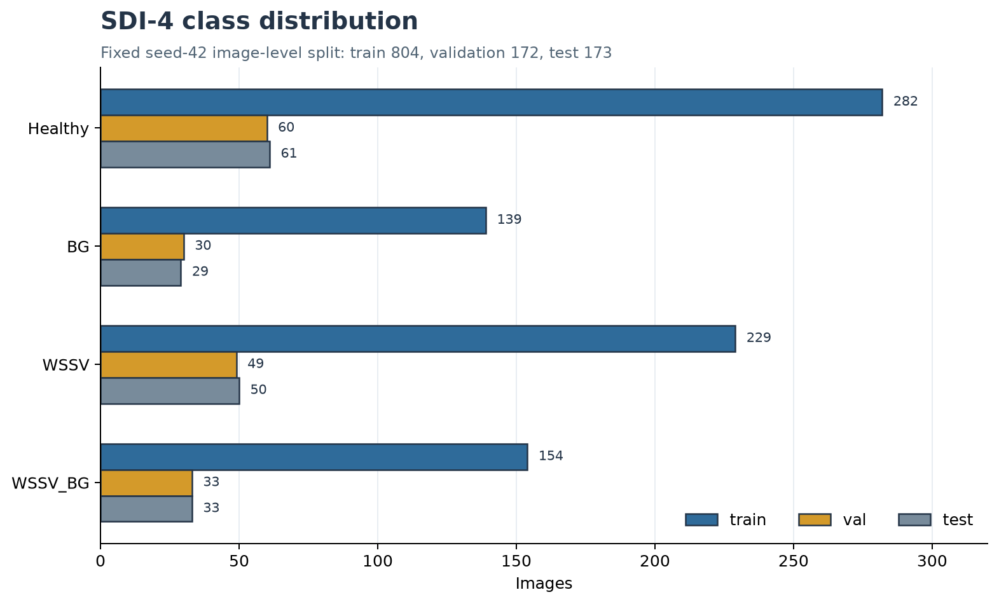
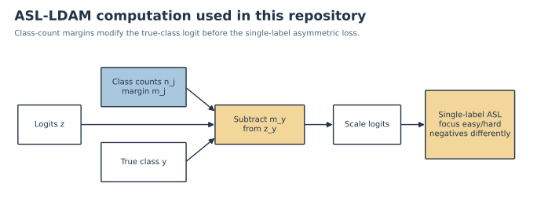
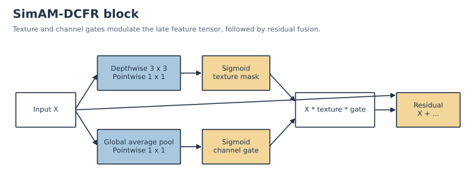
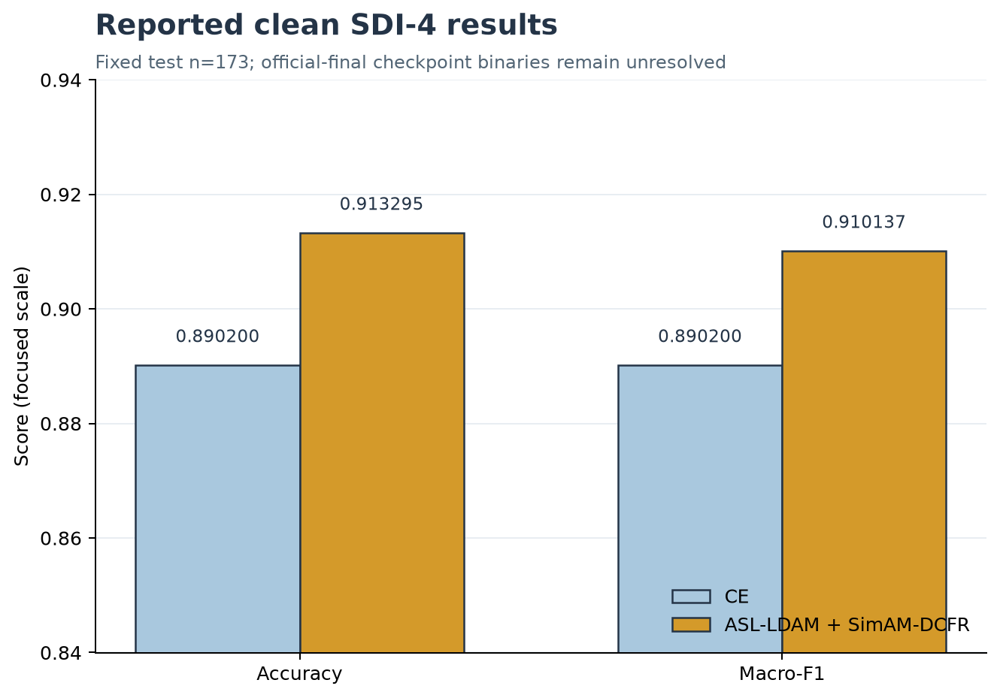
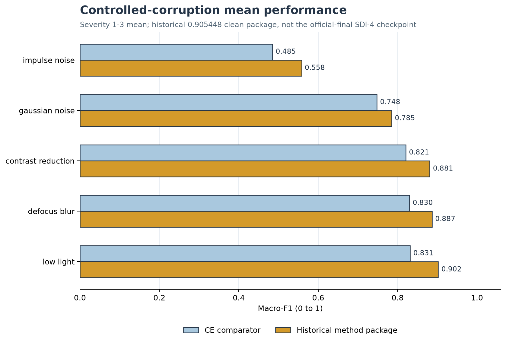
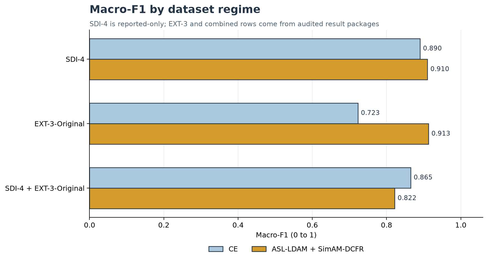
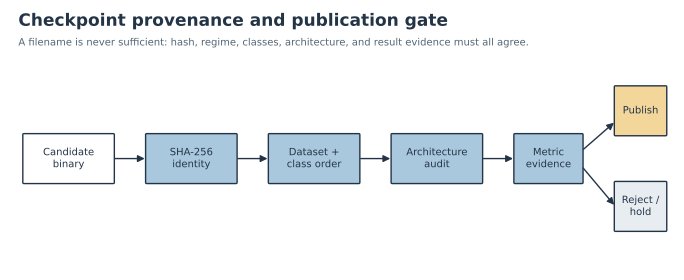
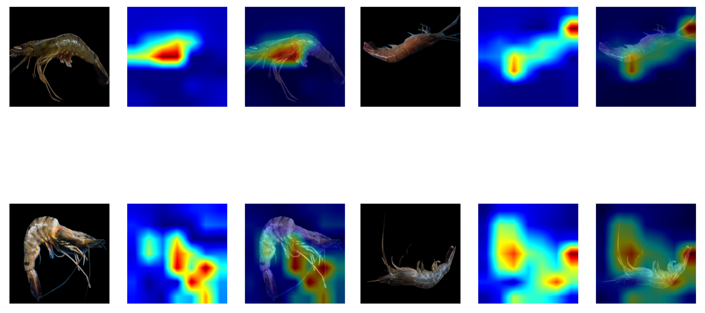

# CVio: imbalance-aware shrimp disease image classification

**Research claim:** on one fixed seed-42 split, the reported SDI-4 selected
ASL-LDAM + SimAM-DCFR result exceeds CE, while audited additional-regime results
show that the advantage is dataset-dependent and reverses after combining
SDI-4 with EXT-3-Original.


> [!IMPORTANT]
> The official SDI-4 metrics are retained result claims, but their exact
> checkpoint binaries were not found. SHA-256 `4305e491...38c1` is a rejected
> historical CE model, not the official proposed checkpoint. Only the two
> three-class EXT-3-Original checkpoints under `weights/` are verified releases.

## Abstract

This repository studies four-class shrimp disease image classification under
class imbalance and controlled image corruption. It combines a YOLO26m
classification backbone with a project single-label ASL-LDAM objective and a
late SimAM-DCFR feature-recalibration block. The fixed SDI-4 seed-42 result
reports Accuracy `0.913295` and Macro-F1 `0.910137`, compared with `0.890200`
for both CE metrics on 173 images. A release audit found no binary that matches
that official architecture and result: the proposed-named uploaded candidate is
a CE architecture and reproduces only Macro-F1 `0.863062`. Two exact-hash
EXT-3-Original checkpoints were verified against a separate 47-image results
package and are released through Git LFS. The combined-regime result favors CE,
providing a retained counterexample to universal superiority.

## Key contributions

- A reproducible single-label composition of LDAM margin adjustment followed by
  asymmetric focusing.
- A project-created late SimAM-DCFR block combining SimAM-style energy attention,
  texture recalibration, a channel gate, and residual fusion.
- A fixed seed-42 split manifest, clean/noise evaluators, deterministic figures,
  and deployment export tooling.
- A checkpoint registry that separates dataset regime, class order, architecture,
  metrics, hashes, and publication status.
- A negative-result record: historical candidates and the combined-regime
  reversal remain visible instead of being relabeled or discarded.

## Dataset regimes

### SDI-4

Four mutually exclusive classes in this exact order: Healthy, BG, WSSV,
WSSV_BG. The fixed image-level split contains 804 train, 172 validation, and
173 test images. “Image-level” does not guarantee specimen-level independence.



*Figure 1. SDI-4 fixed seed-42 distribution. The 173-image test support is
Healthy 61, BG 29, WSSV 50, and WSSV_BG 33. Source:
[`dataset_split_distribution_table_seed42.csv`](artifacts/tables/dataset/dataset_split_distribution_table_seed42.csv).*

### EXT-3-Original

Three classes only: Healthy, BG, WSSV. The audited results package has 47 test
images (11/16/20). Its exact checkpoint hashes are verified and released. An
EXT-3 model must not be used as an SDI-4 replacement because it has no WSSV_BG
output.

### SDI-4 + EXT-3-Original

The retained combined package evaluates 220 images. Its CE result outperforms
the proposed result, so additional source data did not preserve the original
ordering. A legacy display label called the selected CE artifact proposed; the
audit uses its actual source method instead.

## Architecture overview

The classifier transforms a 224 × 224 RGB image into a late feature tensor. The
proposed variant inserts SimAM-DCFR immediately before the original Ultralytics
`Classify` head; CE omits this block. Audited head inputs have shape
`[1, 512, 7, 7]`, and outputs are `[1, 4]` for SDI-4 or `[1, 3]` for EXT-3.


*Figure 2. Proposed model path. Architecture identity is inspected from the
module tree rather than inferred from a filename. See
[`ARCHITECTURE_WALKTHROUGH.md`](docs/ARCHITECTURE_WALKTHROUGH.md).*

## Published versus project-created components

| Component | Status | Role here |
|---|---|---|
| [Ultralytics YOLO classification](https://docs.ultralytics.com/tasks/classify/) | published framework | YOLO26m feature extractor and `Classify` head |
| [LDAM](https://proceedings.nips.cc/paper_files/paper/2019/hash/621461af90cadfdaf0e8d4cc25129f91-Abstract.html) | Cao et al., NeurIPS 2019 | class-count-aware true-class margin |
| [ASL](https://openaccess.thecvf.com/content/ICCV2021/html/Ridnik_Asymmetric_Loss_for_Multi-Label_Classification_ICCV_2021_paper.html) | Ridnik et al., ICCV 2021 | asymmetric focusing principle, adapted to single-label softmax |
| [SimAM](https://proceedings.mlr.press/v139/yang21o) | Yang et al., ICML 2021 | parameter-free energy attention term |
| DCFR branches and residual rule | project-created | learned texture mask and channel gate |
| Late attention injection | project-created | wraps the original `Classify` head |
| LDAM → single-label ASL composition | project-created | exact implemented loss order |

The complete SimAM-DCFR block has learned parameters; only its SimAM term is
parameter-free.

## ASL-LDAM computation

Let `z_j` be class `j`'s logit, `y` the true class, and `n_j` the training count
for class `j`. The implementation computes a normalized LDAM margin
`m_j ∝ n_j^(-1/4)`, subtracts `m_y` only from the true-class logit, multiplies
all adjusted logits by 30, and then applies the repository's single-label
softmax ASL. With `gamma_pos=0`, `gamma_neg=4`, and label smoothing `0.1`, easy
negative classes are down-weighted more strongly than hard negatives.



*Figure 3. Repository loss order. LDAM → single-label ASL is an implementation
choice and is not proven optimal against all alternative formulations. Full
definitions: [`ASL_LDAM_EXPLAINED.md`](docs/ASL_LDAM_EXPLAINED.md).*

## SimAM-DCFR computation

For late tensor `X`, the block computes a SimAM-style spatial energy response,
a sigmoid texture mask through depthwise 3 × 3 then pointwise 1 × 1
convolutions, and a channel gate through global average pooling plus a pointwise
1 × 1 convolution. Residual fusion returns
`X + 0.5 × gate(X) × (simam(X) + texture(X))`.



*Figure 4. Project-created SimAM-DCFR composite. Shape is preserved before the
original head. Full definitions: [`SIMAM_DCFR_EXPLAINED.md`](docs/SIMAM_DCFR_EXPLAINED.md).*

## Main clean results

The table below is the official reported SDI-4 result. It is not a statement
that an official-final binary is available.

| Metric | CE | ASL-LDAM + SimAM-DCFR | Delta |
|---|---:|---:|---:|
| Accuracy | 0.890200 | 0.913295 | +0.023095 |
| Macro-F1 | 0.890200 | 0.910137 | +0.019937 |



*Figure 5. Reported official SDI-4 clean result, test n=173. The y-axis is
focused and does not start at zero; exact values are labeled. The official
checkpoint binaries remain unresolved.*

No retained class-wise report or confusion matrix matches Macro-F1 `0.910137`.
The historical `0.905448` matrices are therefore not displayed as official.
See [`RESULTS.md`](docs/RESULTS.md) for evidence levels.

## Controlled corruption results

The retained corruption experiment belongs to a historical SDI-4 package whose
clean Macro-F1 is `0.905448`. It cannot establish robustness for the unresolved
official-final checkpoint, but it remains a useful controlled sensitivity result.



*Figure 6. Mean Macro-F1 over severities 1–3 for the historical package and its
CE comparator. All five deltas are positive; source-checkpoint identity limits
the claim to that package.*

## Additional-source results reverse the ordering

The proposed method is higher in the reported SDI-4 result and the verified
EXT-3 package, but lower after combining SDI-4 and EXT-3-Original. This reversal
is a direct threat to claims of dataset-independent improvement.



*Figure 7. Macro-F1 by regime. SDI-4 is reported-only, EXT-3 is exact-hash
verified, and the combined row is an audited package. Source:
[`verified_regime_results.csv`](artifacts/release_audit/verified_regime_results.csv).*

| Regime | CE Macro-F1 | Proposed Macro-F1 | Evidence |
|---|---:|---:|---|
| SDI-4 | 0.890200 | 0.910137 | reported metrics; binaries unresolved |
| EXT-3-Original | 0.722990 | 0.912937 | exact hashes/package verified |
| SDI-4 + EXT-3-Original | 0.865105 | 0.821801 | audited package; reversal |

## Checkpoints and verified purpose



*Figure 8. Checkpoint release gate. Hash, regime, class order, architecture, and
metric evidence must agree before publication.*

| Role | SHA-256 | Status | Published location |
|---|---|---|---|
| SDI-4 CE | not located | `UNRESOLVED` | not published |
| SDI-4 proposed | not located | `UNRESOLVED` | not published |
| EXT-3 CE | `055e22...c8ea` | `VERIFIED_EXT3_ORIGINAL_CE` | `weights/ext3_original/yolo26m_cls_ce_seed42_best.pt` via LFS |
| EXT-3 proposed | `ce0352...fb36` | `VERIFIED_EXT3_ORIGINAL_PROPOSED` | `weights/ext3_original/yolo26m_cls_asl_ldam_simam_dcfr_seed42_best.pt` via LFS |
| SDI-4 FP32 TFLite | `9834ec...1689d` | `HISTORICAL_NONFINAL_EXPORT` | retained in `export/`, not approved deployment |
| SDI-4 FP16 TFLite | `c8d1f7...275d7` | `UNRESOLVED_EXPORT` | retained in `export/`, not approved deployment |

The full hashes and metadata are in [`weights/manifest.json`](weights/manifest.json)
and [`CHECKPOINTS.md`](docs/CHECKPOINTS.md). The uploaded SHA
`4305e49158129c4a6acaa8fdaf7b5982a7f4d93cc233f11d17479e04b0e438c1`
is `HISTORICAL_NONFINAL`: CE architecture, Accuracy `0.867052`, Macro-F1
`0.863062`.

## Reproduction commands

```bash
python -m venv .venv
source .venv/bin/activate          # PowerShell: .venv\Scripts\Activate.ps1
python -m pip install -r requirements.txt

python scripts/01_prepare_dataset_and_split.py --seed 42
python scripts/02_train_yolo26m_ce_baseline.py --device 0 --skip-if-complete
python scripts/03_train_yolo26m_asl_ldam_simam_dcfr.py --device 0 --skip-if-complete
python scripts/docs/generate_release_figures.py
```

The split command validates total counts 403/198/328/220 and produces
804/172/173. Full instructions: [`REPRODUCE.md`](docs/REPRODUCE.md).

## Evaluation commands

```bash
python scripts/04_eval_clean.py \
  --weights runs/training/<run>/weights/best.pt \
  --manifest artifacts/manifests/split_manifest_seed42.csv \
  --data-dir /path/to/processed_images \
  --output-dir artifacts/evaluation/<run>/clean \
  --device cpu --imgsz 224

python scripts/05_eval_noise_top5.py \
  --weights runs/training/<run>/weights/best.pt
```

Official-final proposed acceptance requires the four-class architecture and both
clean metrics to match at the predeclared absolute tolerance `1e-6`.

## Export and deployment

```bash
python scripts/06_export_litert_fp32_fp16.py \
  --weights runs/training/<verified-run>/weights/best.pt \
  --out-dir export --imgsz 224
```

Export only from a source checkpoint that has already passed the release gate,
then record its source hash and rerun evaluation. Current TFLite files are
historical/unresolved and must not be called official proposed deployments. See
[`EXPORT_LITERT.md`](docs/EXPORT_LITERT.md).

## Qualitative XAI panel

The panel below contains four selected examples from the historical method
package. It can illustrate where a visualization responds, but it cannot prove
causal feature use, model faithfulness, robustness, or population-level behavior.



*Figure 9. **Qualitative-only warning:** hand-selected correct examples from a
historical package. Do not treat this panel as quantitative validation or as
evidence for the unresolved official-final checkpoint.*

## Repository structure

```text
configs/                 dataset, training, noise, and XAI configuration
src/cvio_asl_ldam/       loss, attention, data, evaluation, export utilities
scripts/                 training, evaluation, audit, export, and figure tools
weights/                 verified registry; EXT-3 binaries through Git LFS
export/                  historical/unresolved TFLite artifacts
artifacts/               manifests, retained tables/figures, release audit
docs/                    methods, results, reproduction, model card, limitations
tests/                   lightweight unit and smoke tests
```

## Limitations and threats to validity

- One seed and one fixed image-level split; no multi-seed variance or
  statistical-significance claim.
- No proof of shrimp/specimen-level independence.
- Official SDI-4 binaries are missing, preventing checkpoint-level reproduction.
- EXT-3 verification lacks a second inference run because the 47 source images
  were unavailable locally.
- Controlled corruptions and XAI belong to a historical nonfinal package.
- The combined-regime reversal limits generalization claims.
- Background removal, acquisition domain, label quality, and runtime versions
  may affect performance.
- LDAM → single-label ASL is not proven optimal among alternative formulations.

See [`CLAIMS_AND_LIMITATIONS.md`](docs/CLAIMS_AND_LIMITATIONS.md) and
[`MODEL_CARD.md`](docs/MODEL_CARD.md).

## Citation

```bibtex
@software{nguyen2026asl_ldam_shrimp,
  title   = {ASL-LDAM with SimAM-DCFR Attention for Robust YOLO-Based Shrimp Disease Image Classification Under Noisy Imaging Conditions},
  author  = {Nguyen, Vinh Dinh and Nguyen, Phong Van and Tran, Nhan Huu and Le Thi, Nhu Huynh},
  year    = {2026},
  version = {0.1.0-paper-asl-ldam},
  url     = {https://github.com/hntnhan1111-ayai/CVio_Shrimp_Disease_Classification_Capstone_SU26}
}
```

Machine-readable citation metadata: [`CITATION.cff`](CITATION.cff).

## License and non-clinical intended use

Code is licensed under AGPL-3.0-or-later; the dataset is not redistributed and
may have separate terms. This repository and its checkpoints are research
artifacts, not veterinary, clinical, laboratory, biosecurity, or autonomous
treatment tools. Expert review and confirmatory testing remain necessary.
