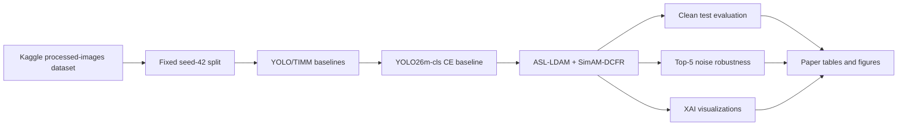
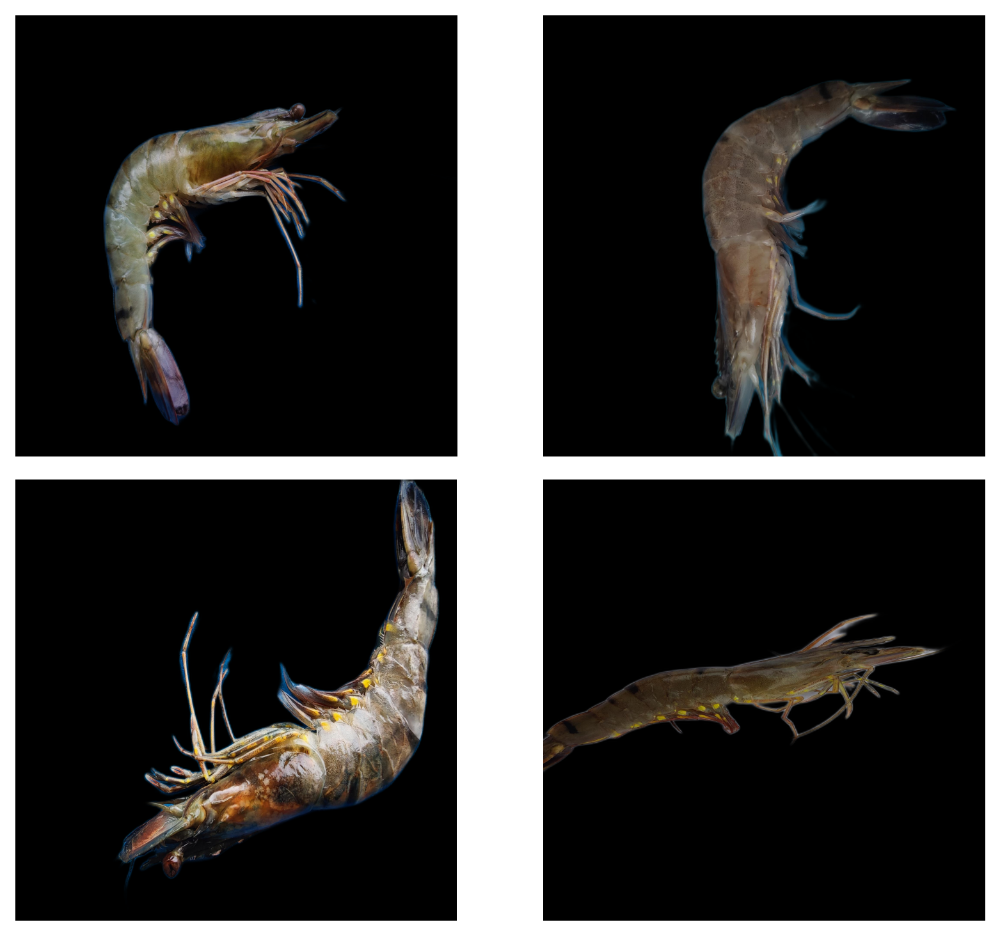
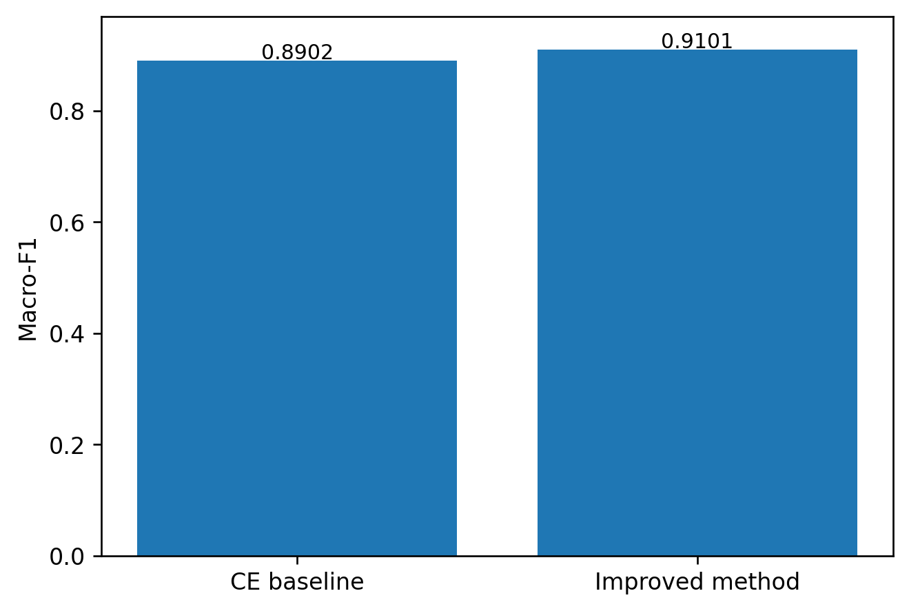
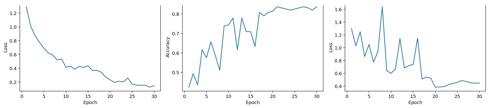

# ASL-LDAM Shrimp Disease Classification

**ASL-LDAM with SimAM-DCFR Attention for Robust YOLO-Based Shrimp Disease Image Classification Under Noisy Imaging Conditions**


> [!IMPORTANT]
> This branch contains the **seed-42-only paper artifact package**. Do not claim mean ± std across multiple seeds and do not claim statistical significance across seeds. The final paper results should be interpreted as results on the fixed seed-42 Stage-1 split.

> [!WARNING]
> No raw dataset, corrupted image folders, trained checkpoints, or model weights are included in this repository.

## Table of Contents

- [Overview](#overview)
- [Scope and Usage Warning](#scope-and-usage-warning)
- [Repository Structure](#repository-structure)
- [Dataset](#dataset)
- [Environment](#environment)
- [Quick Start on Kaggle T4x2](#quick-start-on-kaggle-t4x2)
- [Reproduce Clean-Test Results](#reproduce-clean-test-results)
- [Reproduce Top-5 Noise Robustness](#reproduce-top-5-noise-robustness)
- [Methods](#methods)
- [Main Result](#main-result)
- [YOLO Baseline Comparison](#yolo-baseline-comparison)
- [TIMM Baseline Comparison](#timm-baseline-comparison)
- [Top-5 Noise Robustness](#top-5-noise-robustness)
- [Key Figures](#key-figures)
- [Reproducibility Notes](#reproducibility-notes)
- [Known Limitations](#known-limitations)
- [Citation](#citation)
- [License](#license)
- [Maintainers / Contact](#maintainers--contact)

## Overview

This repository is the curated research-code and artifact release for a
four-class shrimp disease image-classification study. It packages portable
configuration, the fixed seed-42 split manifest, YOLO and TIMM runners,
ASL-LDAM and SimAM-DCFR implementations, top-5 corruption evaluation, XAI
utilities, paper tables, and paper figures.



## Scope and Usage Warning

The package supports paper review and reproducibility for one fixed split. It
does not support multi-seed statistical inference, clinical deployment, or
veterinary diagnosis. See [Claims and Limitations](docs/CLAIMS_AND_LIMITATIONS.md).

## Repository Structure

```text
configs/       Portable dataset, training, noise, and XAI configuration
src/           Importable ASL-LDAM research package
scripts/       Kaggle-facing reproduction commands
experiments/   Experiment entry-point notes
artifacts/     Curated small tables, figures, manifests, XAI, and metadata
notebooks/     Archival reference notebook
paper/         Paper scope, LaTeX title, and writing bundle
docs/          Reproduction, data, results, model-card, and environment docs
tests/         Lightweight tests that do not require the full dataset
```

## Dataset

- Kaggle dataset: `uynnhy/processed-images`
- Classes: `Healthy`, `BG`, `WSSV`, `WSSV_BG`
- Total images: 1,149
- Evaluation split: fixed seed-42 Stage-1 image-level split

| Split | Healthy | BG | WSSV | WSSV_BG | Total |
|---|---:|---:|---:|---:|---:|
| train | 282 | 139 | 229 | 154 | 804 |
| val | 60 | 30 | 49 | 33 | 172 |
| test | 61 | 29 | 50 | 33 | 173 |

```python
import kagglehub

path = kagglehub.dataset_download("uynnhy/processed-images")
print("Path to dataset files:", path)
```

The downloaded Kaggle dataset is already background-removed using U2Net/rembg.
The default reproduction scripts skip background removal because the step is
slow and not required for reproducing the reported experiments. Optional
installation for background removal experiments:

```bash
pip install "rembg[cpu]"
```

Raw dataset files are never committed. Details are in [DATA.md](docs/DATA.md).

## Environment

Reported experiments were run on:

- Kaggle T4x2 GPU
- Python 3.12.3
- CUDA-enabled PyTorch environment
- Main packages: `torch`, `torchvision`, `ultralytics`, `timm`, `numpy`,
  `pandas`, `scikit-learn`, `opencv-python`, `matplotlib`, `seaborn`,
  `PyYAML`, and `kagglehub`

Exact versions must be generated in the active runtime:

```bash
python scripts/99_env_report.py
```

The committed report was generated on the current release workstation and does
not guess missing Kaggle package versions.

| Package | Recorded report value |
|---|---|
| Python | 3.14.0 on the report workstation; paper runtime was 3.12.3 |
| `torch` | not installed in report workstation |
| `torchvision` | not installed in report workstation |
| `ultralytics` | not installed in report workstation |
| `timm` | not installed in report workstation |
| `numpy` | 2.4.0 |
| `pandas` | 2.3.3 |
| `scikit-learn` | not installed in report workstation |
| `opencv-python` | not installed in report workstation |
| `matplotlib` | not installed in report workstation |
| `seaborn` | not installed in report workstation |
| `PyYAML` | 6.0.3 |
| `kagglehub` | 1.0.2 |

See the generated [environment report](docs/ENVIRONMENT.md).

## Quick Start on Kaggle T4x2

```bash
git clone https://github.com/hntnhan1111-ayai/CVio_Shrimp_Disease_Classification_Capstone_SU26.git
cd CVio_Shrimp_Disease_Classification_Capstone_SU26
git switch paper/asl-ldam

python -m pip install -r requirements.txt

export PROJECT_ROOT="$(pwd)"
export DATA_DIR="$PROJECT_ROOT/datasets/processed-images"
export OUTPUT_DIR="$PROJECT_ROOT/runs"
export SEED=42
export DEVICE=auto

python scripts/00_download_dataset.py
bash scripts/01_make_seed42_split.sh
python scripts/99_env_report.py
```

Copy or link the KaggleHub download into `DATA_DIR`, or set `DATA_DIR` directly
to the downloaded folder printed by `scripts/00_download_dataset.py`.

## Reproduce Clean-Test Results

Native YOLO26m cross-entropy baseline:

```bash
MODEL=yolo26m-cls SEED=42 bash scripts/02_run_yolo_baselines.sh
```

Main method:

```bash
bash scripts/04_run_yolo26m_asl_ldam.sh
```

TIMM example:

```bash
MODEL=convnext_tiny_in22k SEED=42 bash scripts/03_run_timm_baselines.sh
```

The runners write checkpoints under ignored `runs/` paths and export small
metrics, predictions, and confusion matrices beside each run.

## Reproduce Top-5 Noise Robustness

After training the main method:

```bash
bash scripts/05_run_noise_eval.sh
```

To evaluate a specific checkpoint:

```bash
WEIGHTS=/path/to/best.pt bash scripts/05_run_noise_eval.sh
```

Only the official five corruptions and severities 1-3 are evaluated. Generated
corrupted images are processed in memory and are not committed.

## Methods

- **Baseline:** native Ultralytics YOLO cross-entropy baseline.
- **Main method:** YOLO26m-cls + ASL-LDAM + SimAM-DCFR.
- **ASL-LDAM:** class-imbalance-aware loss combining asymmetric focusing and
  LDAM-style margin tuning.
- **SimAM-DCFR:** disease-contrast feature recalibration attention variant.
- **Evaluation:** fixed seed-42 clean test set and top-5 noisy/corrupted test
  conditions.
- **Inference scope:** no multi-seed statistical inference is claimed.

Recorded main-method hyperparameters are `gamma_pos=0.0`, `gamma_neg=4.0`,
label smoothing `0.1`, LDAM maximum margin `0.5`, and LDAM scale `30.0`.

## Main Result

| Metric | Baseline CE | Best: ASL-LDAM + SimAM-DCFR | Delta |
|---|---:|---:|---:|
| Macro-F1 | 0.890200 | 0.910137 | +0.019937 |
| Accuracy | 0.890200 | 0.913295 | +0.023095 |
| Cohen's Kappa | 0.850500 | 0.881593 | +0.031093 |

Class-wise clean-test performance:

| Class | Precision | Recall | F1 | Support |
|---|---:|---:|---:|---:|
| Healthy | 1.000 | 0.869 | 0.930 | 61 |
| BG | 0.900 | 0.931 | 0.915 | 29 |
| WSSV | 0.900 | 0.900 | 0.900 | 50 |
| WSSV_BG | 0.800 | 0.970 | 0.877 | 33 |

Source: [key result CSV](artifacts/tables/improvements/paper_key_yolo26m_best_method_vs_stage1_ce_seed42.csv).

## YOLO Baseline Comparison

<details>
<summary><strong>YOLO baseline comparison on fixed seed-42 split</strong></summary>

| Model | Macro-F1 | Accuracy | Kappa | Params (M) | Size (MB) |
|---|---:|---:|---:|---:|---:|
| yolo26m-cls | 0.8902 | 0.8902 | 0.8505 | 10.35 | 19.92 |
| yolo26x-cls | 0.8813 | 0.8902 | 0.8501 | 28.34 | 54.37 |
| yolov8m-cls | 0.8718 | 0.8786 | 0.8342 | 15.77 | 30.22 |
| yolov8s-cls | 0.8710 | 0.8786 | 0.8343 | 5.08 | 9.79 |
| yolo11m-cls | 0.8675 | 0.8728 | 0.8263 | 10.35 | 19.92 |
| yolov8x-cls | 0.8622 | 0.8671 | 0.8192 | 56.13 | 107.28 |
| yolov8l-cls | 0.8586 | 0.8671 | 0.8184 | 36.19 | 69.23 |
| yolo26l-cls | 0.8576 | 0.8613 | 0.8109 | 12.82 | 24.74 |
| yolo26n-cls | 0.8420 | 0.8555 | 0.8014 | 1.53 | 3.05 |
| yolo11x-cls | 0.8374 | 0.8497 | 0.7944 | 28.34 | 54.37 |
| yolo11s-cls | 0.8317 | 0.8382 | 0.7787 | 5.44 | 10.52 |
| yolo11n-cls | 0.8283 | 0.8382 | 0.7775 | 1.53 | 3.05 |
| yolov8n-cls | 0.8271 | 0.8439 | 0.7858 | 1.44 | 2.83 |
| yolo26s-cls | 0.8215 | 0.8324 | 0.7713 | 5.44 | 10.52 |
| yolo11l-cls | 0.8123 | 0.8208 | 0.7560 | 12.82 | 24.74 |

</details>

Full table: [YOLO baseline CSV](artifacts/tables/baselines/yolo_baseline_comparison_seed42.csv).

## TIMM Baseline Comparison

| Model | Macro-F1 | Accuracy | Kappa | Params (M) | FPS | Latency (ms) |
|---|---:|---:|---:|---:|---:|---:|
| convnext_tiny_in22k | 0.8416 | 0.8522 | 0.7690 | 27.82 | 49.2 | 20.34 |
| mobilenet_v3_large | 0.8010 | 0.8261 | 0.6114 | 4.21 | 45.6 | 21.93 |
| efficientnet_b0 | 0.7701 | 0.7913 | 0.5940 | 4.01 | 46.5 | 21.52 |
| repvgg_a0 | 0.7688 | 0.7739 | 0.5514 | 7.83 | 48.1 | 20.81 |
| efficientnet_v2_s | 0.7678 | 0.7739 | 0.6627 | 20.18 | 32.2 | 31.06 |

Full table: [TIMM baseline CSV](artifacts/tables/baselines/timm_baseline_comparison_seed42.csv).

## Top-5 Noise Robustness

| Rank | Noise |
|---:|---|
| 1 | impulse_noise |
| 2 | gaussian_noise |
| 3 | contrast_reduction |
| 4 | defocus_blur |
| 5 | low_light |

| Noise | Baseline Mean Macro-F1 | Best Mean Macro-F1 | Delta |
|---|---:|---:|---:|
| impulse_noise | 0.4850 | 0.5582 | +0.0732 |
| gaussian_noise | 0.7479 | 0.7850 | +0.0371 |
| contrast_reduction | 0.8207 | 0.8810 | +0.0603 |
| defocus_blur | 0.8300 | 0.8866 | +0.0567 |
| low_light | 0.8315 | 0.9022 | +0.0707 |

Source: [noise summary CSV](artifacts/tables/noise/top5_noise_baseline_vs_best_mean_summary.csv).

## Key Figures










## Reproducibility Notes

- Default seed: 42
- Image size: 224
- Epochs: 30
- Patience: 15 for YOLO
- AMP: enabled when CUDA is available
- Workers: 4 by default in portable YOLO config; scripts can be edited to 2
  for tighter Kaggle memory limits
- Device: `0,1` when two CUDA GPUs are detected, otherwise `0` or CPU
- Dataset background removal is skipped because Kaggle already distributes
  U2Net/rembg-processed images
- Results can vary slightly with GPU nondeterminism, library versions, and
  Ultralytics internals

Detailed instructions: [REPRODUCE.md](docs/REPRODUCE.md).

## Known Limitations

- Results are seed-42-only.
- No multi-seed mean ± std is claimed.
- No statistical significance across seeds is claimed.
- The split is image-level and is not asserted to be animal/group-safe.
- No trained weights are distributed.
- TIMM baseline provenance includes a user-supplied seed-42 result table.
- This project is not a clinical or veterinary diagnostic tool.

See [CLAIMS_AND_LIMITATIONS.md](docs/CLAIMS_AND_LIMITATIONS.md) and
[MODEL_CARD.md](docs/MODEL_CARD.md).

## Citation

```bibtex
@software{nguyen2026asl_ldam_shrimp,
  title = {ASL-LDAM with SimAM-DCFR Attention for Robust YOLO-Based Shrimp Disease Image Classification Under Noisy Imaging Conditions},
  author = {Nguyen, Vinh Dinh and Nguyen, Phong Van and Tran, Nhan Huu and Le Thi, Nhu Huynh},
  year = {2026},
  version = {0.1.0-paper-asl-ldam},
  url = {https://github.com/hntnhan1111-ayai/CVio_Shrimp_Disease_Classification_Capstone_SU26}
}
```

Machine-readable metadata: [CITATION.cff](CITATION.cff).

## License

This repository is released for academic reproducibility. The project depends
on third-party libraries, including Ultralytics, PyTorch, and TIMM, which
retain their own licenses. Dataset files are not redistributed in this
repository and must be downloaded from the original Kaggle source.

Code in this repository is released under AGPL-3.0-or-later.

## Maintainers / Contact

- Vinh Dinh Nguyen
- Phong Van Nguyen
- Nhan Huu Tran
- Nhu Huynh Le Thi

Use the repository issue tracker for artifact and reproduction questions.
