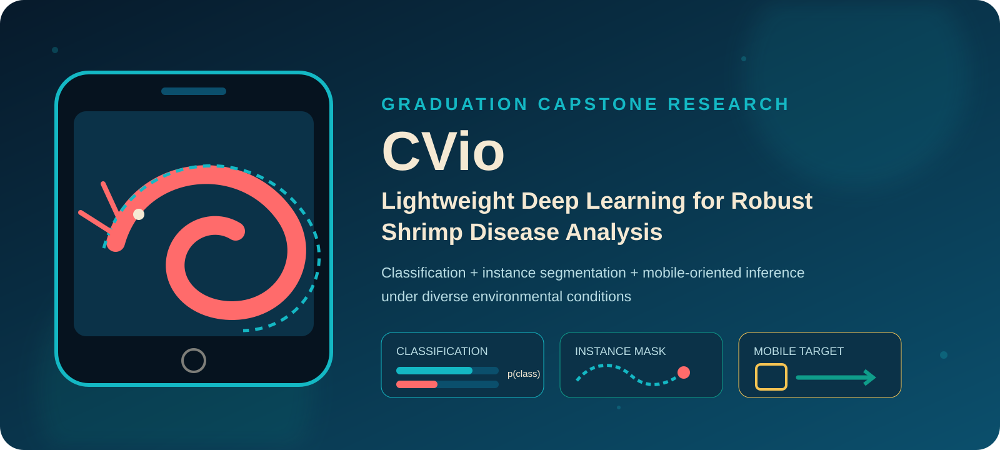
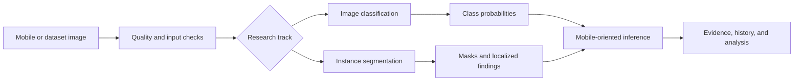
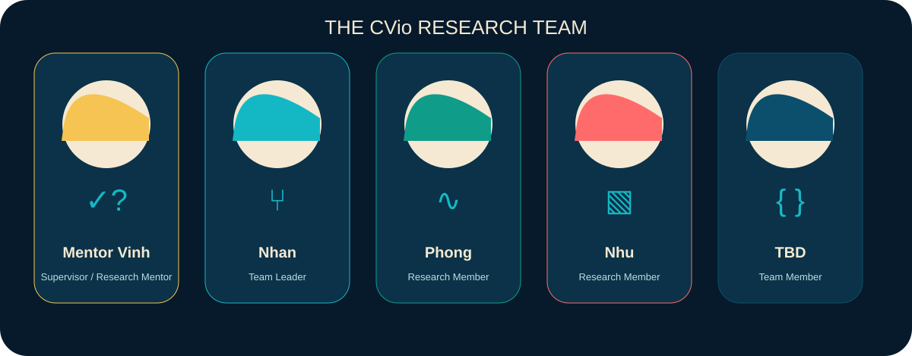

<p align="center">
  
</p>

<h1 align="center">CVio</h1>

<p align="center">
  <strong>Lightweight Deep Learning for Robust Shrimp Disease Analysis</strong><br>
  Shrimp Disease Classification and Instance Segmentation for Mobile Deployment under Diverse Environmental Conditions
</p>

<p align="center">
  <a href="https://github.com/hntnhan1111-ayai/CVio_Shrimp_Disease_Classification_Capstone_SU26/actions/workflows/docs-quality.yml"></a>
  <a href="https://github.com/hntnhan1111-ayai/CVio_Shrimp_Disease_Classification_Capstone_SU26/actions/workflows/link-check.yml"></a>
  <a href="https://github.com/hntnhan1111-ayai/CVio_Shrimp_Disease_Classification_Capstone_SU26/actions/workflows/asset-check.yml"></a>
</p>

<p align="center">
  
</p>

> [!IMPORTANT]
> **Research status:** Active graduation-capstone development. A metric is publishable here only when it is traceable to a dataset version, split, configuration, seed, checkpoint, evaluation command, and evidence file.

<p align="center">
  <a href="#overview">Overview</a> ·
  <a href="#research-tracks">Research Tracks</a> ·
  <a href="#system-overview">System</a> ·
  <a href="docs/DATASETS.md">Datasets</a> ·
  <a href="docs/EXPERIMENTS.md">Experiments</a> ·
  <a href="docs/RESULTS.md">Results</a> ·
  <a href="docs/MOBILE_DEPLOYMENT.md">Mobile</a> ·
  <a href="docs/REPRODUCIBILITY.md">Reproducibility</a> ·
  <a href="#research-team">Team</a> ·
  <a href="#citation">Citation</a>
</p>

## Overview

CVio is a graduation capstone investigating lightweight computer-vision methods for shrimp disease analysis from realistic imagery. Its intended research surface combines image-level classification, instance-level segmentation, and deployment-aware evaluation. The study scope includes illumination variation, blur, noise, viewpoint changes, and complex aquaculture backgrounds; controlled evidence for each condition remains subject to the protocol and provenance requirements below.

This landing page describes the integrated project contract. Topic branches contain active research work, but branch-local artifacts are not automatically promoted to verified `main` results.

## Why CVio?

Visual inspection can answer complementary questions:

- **Classification:** What image-level disease category is supported by the input?
- **Instance segmentation:** Where are annotated disease manifestations or shrimp instances located?
- **Mobile-oriented inference:** What accuracy, footprint, latency, memory, and operator constraints appear on a named target device?

CVio treats robustness and deployment as measurable evaluation dimensions—not marketing labels. No clinical, diagnostic, production, or real-time claim is made by this repository.

## Research objectives

| Objective | Evidence state |
|---|---|
| Establish reproducible classification baselines and proposed variants | Active work; integrated protocol pending |
| Establish leakage-aware instance-segmentation baselines and proposed variants | Active work; integrated protocol pending |
| Evaluate controlled environmental corruptions | Protocol and accepted benchmark pending |
| Export and benchmark selected lightweight models on mobile targets | Device-level evidence pending |
| Preserve dataset, checkpoint, config, command, and metric provenance | Repository contract established |

## Research tracks

### Track A — Image classification

**Task.** Map an input image to a declared image-level class distribution.

| Component | Integrated `main` status |
|---|---|
| Dataset and class ontology | [Pending verification](docs/DATASETS.md) |
| Reference baseline | TBD |
| Team reimplementation | Active on topic branches; not yet integrated |
| Proposed method | Pending frozen definition |
| Verified metrics | [No values published](docs/RESULTS.md) |

Classification accuracy, macro-F1, per-class recall, and calibration must be reported separately and only when their definitions and evidence are present.

### Track B — Instance segmentation

**Task.** Predict instance masks for the annotation categories defined by a versioned dataset card.

| Component | Integrated `main` status |
|---|---|
| Dataset and annotation format | [Pending verification](docs/DATASETS.md) |
| Leakage-aware split | Pending integrated manifest |
| Reference baseline | TBD |
| Proposed modules | Pending frozen definition |
| Verified mask metrics | [No values published](docs/RESULTS.md) |

Mask AP, box AP, IoU, and qualitative overlays must not be presented as classification metrics. Healthy image-level states must not be silently converted into localization labels.

## System overview



The diagram is the intended integrated flow. Exact preprocessing, model routing, thresholds, and output handling remain `TBD` until executable artifacts are merged.

## Repository structure

```text
.
├── .github/                 Issue forms, PR template, and documentation CI
├── docs/
│   ├── assets/              Original CVio brand, hero, team, and gallery assets
│   ├── audits/              Baseline, claim, metric, and final-state audits
│   ├── DATASETS.md          Dataset-card requirements and verified inventory
│   ├── EXPERIMENTS.md       Experiment contract and registry
│   ├── RESULTS.md           Provenance-first result tables
│   ├── MOBILE_DEPLOYMENT.md Device benchmark protocol
│   └── REPRODUCIBILITY.md   Executable-command readiness
├── scripts/docs/            Deterministic asset generation and offline checks
├── CITATION.cff
├── CONTRIBUTING.md
├── CODE_OF_CONDUCT.md
├── SECURITY.md
└── README.md
```

Research code is not yet integrated on `main`; see the [roadmap](docs/ROADMAP.md) before relying on topic-branch layouts.

## Datasets

No dataset is redistributed or approved as the integrated source of truth on `main`. Each accepted dataset must document source, license, classes, counts, instances, immutable split identity, leakage checks, preprocessing, limitations, and access conditions in [the dataset registry](docs/DATASETS.md).

## Methods

| Track | Reference baseline | Team implementation | Proposed method | Status |
|---|---|---|---|---|
| Classification | TBD | Topic-branch work exists | Pending frozen definition | Pending integration |
| Instance segmentation | TBD | Topic-branch work exists | Pending frozen definition | Pending integration |

“Paper-reported,” “team reimplementation,” “proposed method,” “ablation,” and “selected final run” are separate evidence labels. A guided reimplementation is not called an exact reproduction without protocol-level proof.

## Experimental protocol

An accepted run must record environment, hardware, software versions, seed, data and split IDs, preprocessing, augmentation, optimizer, schedule, epochs, selection rule, evaluation command, checkpoint hash, and task-specific thresholds. See [Experiments](docs/EXPERIMENTS.md).

## Results

There are currently **no verified integrated metrics on `main`**. This is deliberate: topic-branch measurements have not yet passed the integrated provenance audit.

| Experiment ID | Track | Dataset / split | Model | Seed | Primary metric | Checkpoint | Config | Status |
|---|---|---|---|---:|---|---|---|---|
| TBD | Classification | TBD | TBD | TBD | TBD | TBD | TBD | Pending verification |
| TBD | Instance segmentation | TBD | TBD | TBD | TBD | TBD | TBD | Pending verification |

The complete registry, status vocabulary, and publication gate are in [Results](docs/RESULTS.md).

## Qualitative analysis

The future gallery must include representative successes, difficult environmental conditions, and failure cases selected by a declared rule. It must not contain only best-looking samples. Until evidence is integrated, the repository provides only an original academic illustration in the [CVio Gallery](docs/GALLERY.md).

## Mobile deployment

Export format, input size, quantization, device, runtime, backend, warm-up, run count, latency distribution, model size, peak memory, and unsupported operators are all pending. “Real-time” will not be used without a device-specific threshold and protocol. See [Mobile Deployment](docs/MOBILE_DEPLOYMENT.md).

## Reproducibility

Executable setup, validation, training, evaluation, export, and benchmark commands are intentionally not invented while `main` lacks runtime code. [Reproducibility](docs/REPRODUCIBILITY.md) identifies exactly what must be merged before commands can be published.

Documentation assets can be regenerated and checked now:

```powershell
python scripts/docs/generate_visual_assets.py
python scripts/docs/generate_shrimp_gif.py
python scripts/docs/check_readme_links.py
python scripts/docs/check_assets.py
python scripts/docs/validate_result_tables.py
```

## Research team

The avatars are abstract role illustrations, not likenesses or claims about personal identity.

<p align="center">
  
</p>

| Person | Verified role |
|---|---|
| Mentor Vinh | Supervisor / Research Mentor |
| Nhan | Team Leader |
| Phong | Research Member |
| Nhu | Research Member |
| TBD | Team Member |

The fourth student name remains unresolved because no reliable evidence was found on `main` or in Git authorship. Biographies, affiliations, profile links, portraits, and individual contribution claims are intentionally omitted.

## Graduation capstone milestones

| Milestone | Date | Evidence state |
|---|---|---|
| Integrated research scope | Pending confirmation | Scope documented; implementation pending merge |
| Dataset and split freeze | TBD | Not complete on `main` |
| Baseline freeze | TBD | Not complete on `main` |
| Proposed-method freeze | TBD | Not complete on `main` |
| Mobile benchmark | TBD | Not complete on `main` |
| Final capstone release | TBD | Not complete on `main` |

## Citation

Citation metadata is provided in [`CITATION.cff`](CITATION.cff). It uses a collective team author until individual names, preferred citation order, institution, release version, and release date are confirmed.

## License and data governance

No repository-level source-code license was present at the audited `main` HEAD. Until maintainers select and add one, default copyright restrictions apply; cloning access does not imply permission to reuse. Dataset, model-weight, and third-party terms must be documented separately. See [License Status](LICENSE_STATUS.md) and [Datasets](docs/DATASETS.md).

All visual assets in `docs/assets/` are original, programmatically generated CVio artwork; their current reuse status follows the repository’s unresolved license status.

## Acknowledgements

CVio is represented as a graduation capstone project. Institutional affiliation, external funding, dataset-author acknowledgements, and framework citations remain pending verified project records.

<details>
<summary>Small ASCII shrimp</summary>

```text
          __
     ____/  \__
  __/  _  _   \___
 <___/(_)(_)_______>
      /_/\_\
       CVio
```

</details>
