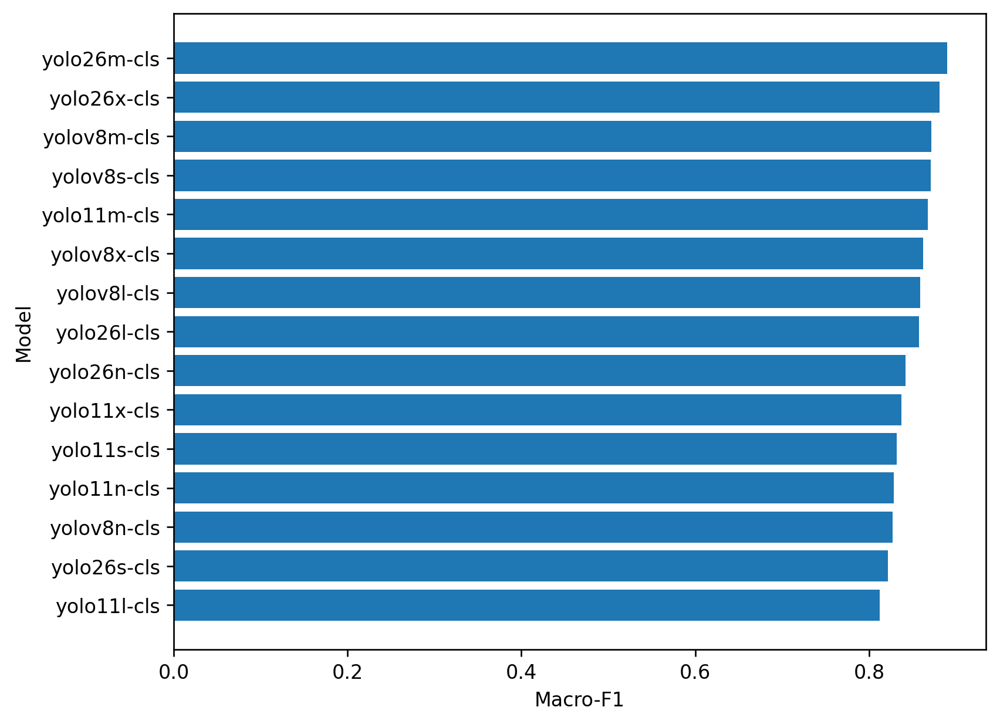
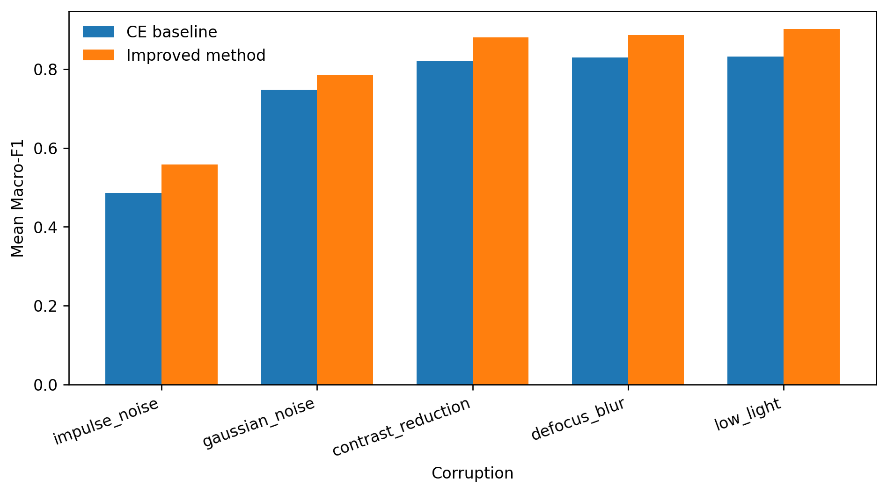

# Robust YOLO-Based Shrimp Disease Classification

**ASL-LDAM with SimAM-DCFR Attention for Robust YOLO-Based Shrimp Disease Image Classification Under Noisy Imaging Conditions**

## Scope and Usage Warning

- This branch contains the **seed-42-only** paper artifact package.
- Do not claim mean ± std across multiple seeds.
- Do not claim statistical significance across seeds.
- The final paper results should be interpreted as results on the fixed seed-42 Stage-1 split.
- No model weights/checkpoints are included.
- No raw dataset or corrupted image dataset folders are included.
- This branch is for paper writing, artifact review, and reproducibility code organization.

## Dataset and Split

Fixed seed-42 Stage-1 split:

| Split | Healthy | BG | WSSV | WSSV_BG | Total |
|---|---|---|---|---|---|
| train | 282 | 139 | 229 | 154 | 804 |
| val | 60 | 30 | 49 | 33 | 172 |
| test | 61 | 29 | 50 | 33 | 173 |

Classes: Healthy, BG, WSSV, WSSV_BG

## Methods

The paper evaluates **YOLO26m-cls + ASL-LDAM + SimAM-DCFR** as a practical model-specific improvement over the native Ultralytics YOLO cross-entropy (CE) baseline.

- **ASL-LDAM**: class-imbalance-aware loss combining asymmetric focusing and LDAM-style margin tuning.
- **SimAM-DCFR**: attention / recalibration variant used for the best method.
- **Baseline**: native Ultralytics YOLO CE baseline on the fixed seed-42 Stage-1 split.
- **Evaluation**: clean test set and top-5 noisy/corrupted test conditions.

Kaggle reference configuration: T4x2 GPU, Python 3.12.3, 30 epochs, image size 224.

## Main YOLO Result

On the fixed seed-42 Stage-1 split, YOLO26m-cls with ASL-LDAM and SimAM-DCFR improved over the CE baseline:

| Metric | Baseline CE | Best (ASL-LDAM + SimAM-DCFR) | Delta |
|---|---|---|---|
| Macro-F1 | 0.890200 | 0.910137 | +0.019937 |
| Accuracy | 0.890200 | 0.913295 | +0.023095 |
| Cohen's Kappa | 0.850500 | 0.881593 | +0.031093 |

Class-wise performance on the clean test set:

| Class | Precision | Recall | F1 | Support |
|---|---|---|---|---|
| Healthy | 1.000 | 0.869 | 0.930 | 61 |
| BG | 0.900 | 0.931 | 0.915 | 29 |
| WSSV | 0.900 | 0.900 | 0.900 | 50 |
| WSSV_BG | 0.800 | 0.970 | 0.877 | 33 |

## YOLO Baseline Comparison (Top-5)

| Model | Macro-F1 | Accuracy | Kappa | Params (M) | Size (MB) |
|---|---|---|---|---|---|
| yolo26m-cls | 0.8902 | 0.8902 | 0.8505 | 10.35 | 19.92 |
| yolo26x-cls | 0.8813 | 0.8902 | 0.8501 | 28.34 | 54.37 |
| yolov8m-cls | 0.8718 | 0.8786 | 0.8342 | 15.77 | 30.22 |
| yolov8s-cls | 0.8710 | 0.8786 | 0.8343 | 5.08 | 9.79 |
| yolo11m-cls | 0.8675 | 0.8728 | 0.8263 | 10.35 | 19.92 |

Full table: `paper_artifacts/asl_ldam_simam_dcfr_yolo_seed42/tables/baselines/yolo_baseline_comparison_seed42.csv`

## TIMM Baseline Comparison (Top-5)

| Model | Macro-F1 | Accuracy | Kappa | Params (M) | FPS | Latency (ms) |
|---|---|---|---|---|---|---|
| convnext_tiny_in22k | 0.8416 | 0.8522 | 0.7690 | 27.82 | 49.2 | 20.34 |
| mobilenet_v3_large | 0.8010 | 0.8261 | 0.6114 | 4.21 | 45.6 | 21.93 |
| efficientnet_b0 | 0.7701 | 0.7913 | 0.5940 | 4.01 | 46.5 | 21.52 |
| repvgg_a0 | 0.7688 | 0.7739 | 0.5514 | 7.83 | 48.1 | 20.81 |
| efficientnet_v2_s | 0.7678 | 0.7739 | 0.6627 | 20.18 | 32.2 | 31.06 |

Full table: `paper_artifacts/asl_ldam_simam_dcfr_yolo_seed42/tables/baselines/timm_baseline_comparison_seed42.csv`

## Improvement vs Baseline

YOLO models: yolo11s-cls, yolo26s-cls, yolo26m-cls, and yolov8n-cls improved with ASL-LDAM + SimAM-DCFR. Some models (e.g., yolov8m-cls, yolo26n-cls, yolov8s-cls, yolo11m-cls, yolo11n-cls) showed mixed or negative deltas. The strongest result remains YOLO26m-cls + ASL-LDAM + SimAM-DCFR, which is the main focus of the paper.

TIMM models: deltas are mixed; most TIMM models showed decreased Macro-F1 with ASL-LDAM + SimAM-DCFR under noise evaluation, suggesting the improvement is strongest for the YOLO backbone.

Full tables:
- `paper_artifacts/asl_ldam_simam_dcfr_yolo_seed42/tables/improvements/yolo_best_method_vs_baseline_seed42.csv`
- `paper_artifacts/asl_ldam_simam_dcfr_yolo_seed42/tables/improvements/timm_best_method_vs_baseline_seed42.csv`

## Top-5 Noise Robustness

Official top-5 noisy conditions selected from the weakest CE baseline corruptions:

| Rank | Noise |
|---|---|
| 1 | impulse_noise |
| 2 | gaussian_noise |
| 3 | contrast_reduction |
| 4 | defocus_blur |
| 5 | low_light |

Best-method performance under noise (Mean Macro-F1 across severities 1-3):

| Noise | Baseline Mean Macro-F1 | Best Mean Macro-F1 | Delta |
|---|---|---|---|
| impulse_noise | 0.4850 | 0.5582 | +0.0732 |
| gaussian_noise | 0.7479 | 0.7850 | +0.0371 |
| contrast_reduction | 0.8207 | 0.8810 | +0.0603 |
| defocus_blur | 0.8300 | 0.8866 | +0.0567 |
| low_light | 0.8315 | 0.9022 | +0.0707 |

Full tables:
- `paper_artifacts/asl_ldam_simam_dcfr_yolo_seed42/tables/noise/top5_noise_selection_from_ce_baseline.csv`
- `paper_artifacts/asl_ldam_simam_dcfr_yolo_seed42/tables/noise/top5_noise_baseline_vs_best_mean_summary.csv`

## Key Figures


*Representative samples from all four classes.*


*YOLO native baseline Macro-F1 comparison on seed-42 Stage-1 split.*


*Key result: YOLO26m-cls baseline vs. ASL-LDAM + SimAM-DCFR.*


*Top-5 noise robustness comparison.*


*Training curves for the best method (top-1 loss).*


*XAI visualization for the best method across all four classes.*

## Reproducibility

Experiment code is located in `experiments/asl_ldam_simam_dcfr_yolo_seed42/`.

Available runners:

- `run_v5_timm_full_one_model.sh` — run a single TIMM model on seed-42
- `run_v5_timm_full_all_models.sh` — iterate all TIMM models
- `run_v5_timm_smoke_one_model.sh` — quick smoke test for one TIMM model
- `run_v5_timm_smoke_all_models.sh` — quick smoke test for all TIMM models
- `final_loss_cbam_top5_noise_stage1split_timm_runner_v5.py` — TIMM runner script
- `collect_v5_yolo_timm_all_results.sh` — aggregator for final reports
- `collect_v5_timm_results.sh` — TIMM result collector
- `inspect_v5_timm_one_model_results.sh` — result inspection helper

Example smoke run (TIMM):
```bash
cd experiments/asl_ldam_simam_dcfr_yolo_seed42
bash run_v5_timm_smoke_one_model.sh mobilenet_v3_large 42
```

Example full run (TIMM):
```bash
cd experiments/asl_ldam_simam_dcfr_yolo_seed42
bash run_v5_timm_full_one_model.sh convnext_tiny 42
```

Example aggregate:
```bash
cd experiments/asl_ldam_simam_dcfr_yolo_seed42
bash collect_v5_yolo_timm_all_results.sh
```

> **Note**: The scripts above reference `/home/drnguyenvinh/notebooks` as the working directory. Adjust paths to match your environment. The artifact package in this repository contains the pre-generated results and figures; no training or evaluation needs to be rerun for paper review.

## Links

- Root artifact folder: `paper_artifacts/asl_ldam_simam_dcfr_yolo_seed42/`
- Experiment code: `experiments/asl_ldam_simam_dcfr_yolo_seed42/`
- Paper scope notes: `paper/asl_ldam_simam_dcfr_yolo_seed42/README_paper_scope.md`
- All tables: `paper_artifacts/asl_ldam_simam_dcfr_yolo_seed42/tables/`
- All figures: `paper_artifacts/asl_ldam_simam_dcfr_yolo_seed42/figures/`
