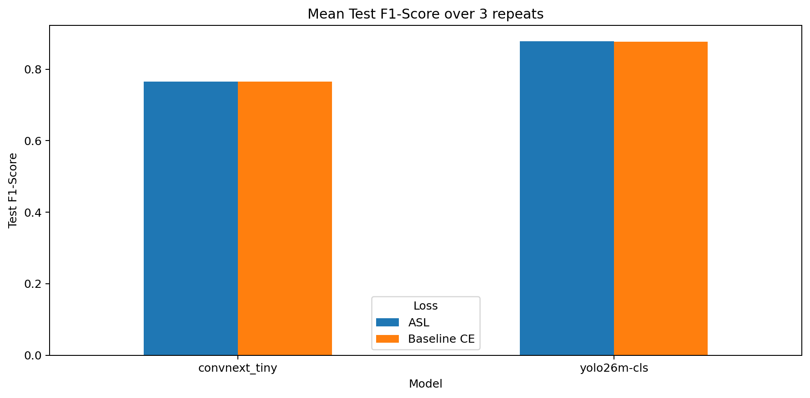
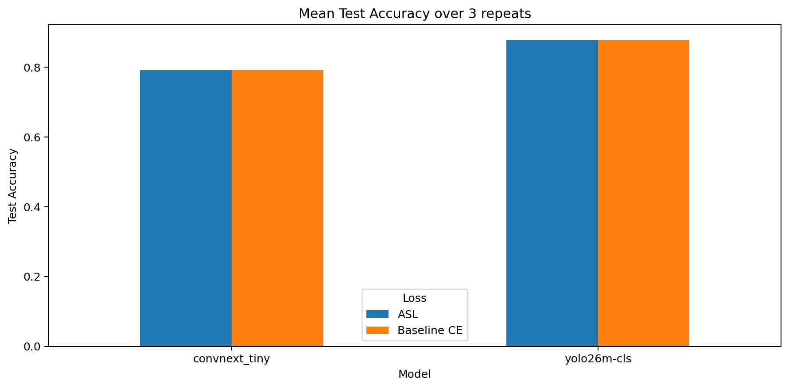
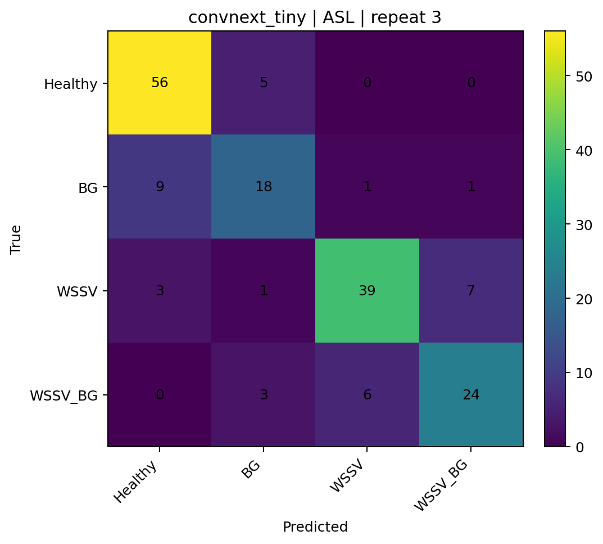

# CVio_Shrimp_Disease_Classification_Capstone_SU26

Tài liệu này mô tả cấu trúc lưu trữ notebook, môi trường thực thi, và tổng hợp kết quả tốt nhất đã đạt được từ thư mục báo cáo `final_yolo26m_convnext_tiny_ce_asl_original_yolo_best_repeat3_outputs`.

## Cấu trúc thư mục

- `best`: chứa notebook tốt nhất tính đến hiện tại. Đây là những phiên bản pipeline có hiệu suất cao nhất và được xem là cơ sở chính để tham chiếu.
- `experiment`: chứa các notebook sử dụng trong quá trình thử nghiệm, điều chỉnh và đánh giá nhiều cấu hình trước khi chọn mô hình tối ưu.
- `legacy`: chứa các notebook cũ, các phiên bản trước đó, hoặc các notebook không còn được ưu tiên sử dụng nhưng vẫn được giữ lại để đối chiếu và truy vết.

## Môi trường thực thi

- Python: 3.12
- Chiến lược đánh giá: so sánh giữa `ASL` và `Baseline CE` trên hai backend chính `convnext_tiny` và `yolo26m-cls`
- Tiêu chí chọn mô hình tốt nhất: `val_macro_f1`

## Kết quả tốt nhất

Kết quả dưới đây được tổng hợp từ các file báo cáo trong thư mục `final_yolo26m_convnext_tiny_ce_asl_original_yolo_best_repeat3_outputs/reports` và các file ảnh trong `final_yolo26m_convnext_tiny_ce_asl_original_yolo_best_repeat3_outputs/plots`.

| Mô hình | Loss | Val Macro F1 | Test Accuracy | Test Precision | Test Recall | Test F1-Score | FPS | Latency (ms) |
| --- | --- | ---: | ---: | ---: | ---: | ---: | ---: | ---: |
| convnext_tiny | ASL | 0.8810 | 0.7919 | 0.7720 | 0.7615 | 0.7655 | 24.98 | 40.08 |
| convnext_tiny | Baseline CE | 0.8810 | 0.7919 | 0.7720 | 0.7615 | 0.7655 | 22.29 | 45.67 |
| yolo26m-cls | ASL | 0.8244 | 0.8786 | 0.8834 | 0.8850 | 0.8787 | 15.59 | 64.24 |
| yolo26m-cls | Baseline CE | 0.8126 | 0.8786 | 0.8787 | 0.8859 | 0.8770 | 15.04 | 66.71 |

### Nhận xét chuyên môn

- `convnext_tiny + ASL` là cấu hình có chất lượng xác thực tốt nhất theo `val_macro_f1` và đồng thời giữ được hiệu suất suy luận cân bằng.
- Trên tập kiểm tra, kết quả của `convnext_tiny + ASL` đạt `Test F1-Score = 0.7655` và `Test Accuracy = 0.7919`.
- `yolo26m-cls` có `Test Accuracy` cao hơn, nhưng `convnext_tiny + ASL` vẫn là căn cứ chính để xem là pipeline tốt nhất do có kết quả xác thực ổn định và phù hợp với tiêu chí lựa chọn đã định.

## Trực quan hóa kết quả

Hình ảnh dưới đây được lấy trực tiếp từ thư mục báo cáo. Khi đọc README trên GitHub hoặc trong VS Code, các hình này sẽ giúp so sánh nhanh giữa các mô hình và các tiếp cận loss.

### Tổng hợp Test F1-Score

### Tổng hợp Test Accuracy

### Ma trận nhầm lẫn của cấu hình tốt nhất

## Tài liệu báo cáo

- Báo cáo phân loại cho cấu hình tốt nhất: `final_yolo26m_convnext_tiny_ce_asl_original_yolo_best_repeat3_outputs/reports/classification_report_repeat03_convnext_tiny_asl.csv`
- Báo cáo tổng hợp 3 lần chạy: `final_yolo26m_convnext_tiny_ce_asl_original_yolo_best_repeat3_outputs/reports/ce_asl_convnext_tiny_yolo26m_repeat3_summary.csv`
- Báo cáo độ bền vững: `final_yolo26m_convnext_tiny_ce_asl_original_yolo_best_repeat3_outputs/reports/ce_asl_convnext_tiny_yolo26m_repeat3_reproducibility_stats.csv`

## Ghi chú về cách đọc README

- Ưu tiên bảng tổng hợp khi cần đối chiếu nhanh giữa các cấu hình.
- Ưu tiên hình ảnh khi cần đánh giá bức tranh tổng quan về hiệu suất mô hình.
- Ưu tiên các file `reports/` khi cần kiểm tra lại số liệu gốc hoặc lặp lại phân tích.
