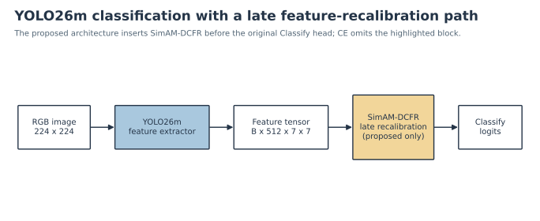

# Architecture walkthrough

## Result first

The proposed classifier is a YOLO26m classification backbone followed by a
project-created late SimAM-DCFR recalibration block and the original
`Classify` head. The audited EXT-3 proposed checkpoint implements this order;
the rejected SDI-4 candidate with SHA-256 `4305e491...38c1` does not.

*Figure 1. Proposed late-recalibration path. The CE model routes the feature
tensor directly to `Classify`; the proposed model inserts the highlighted
project-created block.*

## Terms and tensor shapes

- A **tensor** is a multidimensional numeric array. An image batch is represented
  as `[batch, channel, height, width]`.
- A **feature map** is the spatial activation grid produced by a convolutional
  layer for one or more learned features.
- A **feature channel** is one slice of that tensor along its channel dimension.
  Different channels can respond to different visual patterns.
- A **logit** is an unnormalized class score output by the classifier. Softmax
  converts the four or three logits into probabilities.

For the audited checkpoints, a 224 × 224 RGB input reaches the classification
head as a `[1, 512, 7, 7]` feature tensor. The output shape is `[1, 4]` for
SDI-4 and `[1, 3]` for EXT-3-Original.

## Processing path

1. The YOLO26m feature extractor converts the RGB image into late feature maps.
2. In the proposed architecture, `AttentionBeforeClassify` passes those features
   through `SimAMDCFR`.
3. SimAM-DCFR combines a parameter-free SimAM response, a learned texture mask,
   and a learned channel gate through residual fusion.
4. The unchanged Ultralytics `Classify` head pools the recalibrated features and
   returns one logit per class.
5. Training uses either cross-entropy (CE) or the project ASL-LDAM loss. Model
   architecture and loss identity are audited independently.

## Published and project-created components

| Component | Origin | Repository role |
|---|---|---|
| YOLO26m classification model and `Classify` head | [Ultralytics classification framework](https://docs.ultralytics.com/tasks/classify/) | Published framework used as backbone/head |
| LDAM margin | [Cao et al., NeurIPS 2019](https://proceedings.nips.cc/paper_files/paper/2019/hash/621461af90cadfdaf0e8d4cc25129f91-Abstract.html) | Published class-count-aware margin principle |
| ASL | [Ridnik et al., ICCV 2021](https://openaccess.thecvf.com/content/ICCV2021/html/Ridnik_Asymmetric_Loss_for_Multi-Label_Classification_ICCV_2021_paper.html) | Published asymmetric focusing principle, adapted here to single-label softmax |
| SimAM | [Yang et al., ICML 2021](https://proceedings.mlr.press/v139/yang21o) | Published parameter-free neuron-energy attention term |
| DCFR texture/channel branches | This project | Depthwise/pointwise texture mask, channel gate, and residual fusion |
| `AttentionBeforeClassify` injection | This project | Inserts the recalibration block immediately before the original head |
| LDAM → single-label ASL composition | This project | Applies the true-class margin and scale before this repository's ASL implementation |

“SimAM-DCFR” should therefore not be read as the unmodified published SimAM
module. It is a project-created composite that includes SimAM-inspired energy
attention plus learned DCFR branches.

## Audit invariants

A proposed checkpoint must contain `AttentionBeforeClassify` and `SimAMDCFR`,
preserve the head input/output shapes, and match its dataset class order. A
proposed-looking filename, stored run name, or result-table label is not enough.
See [CHECKPOINTS.md](CHECKPOINTS.md) for the release decisions.
