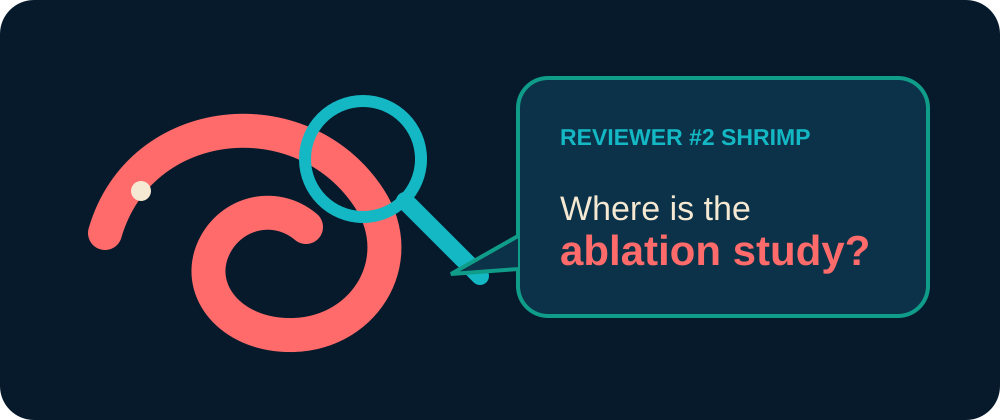

# CVio Gallery

The gallery holds original, harmless academic illustrations. It is separate from scientific qualitative evidence.

The panel is generated by `scripts/docs/generate_visual_assets.py`. It uses no meme template, copyrighted character, portrait, external font, or remote resource.

Future ideas—“Tiny Object, Large Problem,” “Data Leakage Patrol,” “Mobile Deployment Gym,” and “No Metric Without Provenance”—remain unimplemented to keep the repository restrained.
