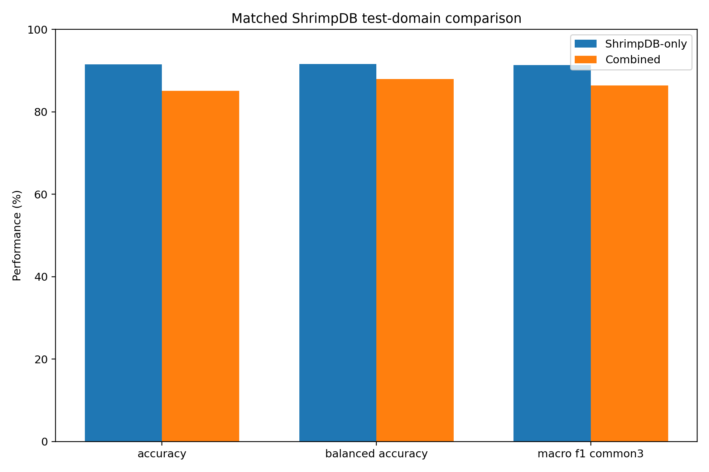

# ASL-LDAM + SimAM-DCFR for Multi-Source Shrimp Disease Image Classification

[](#reproduction)
[](#reproducibility)
[](#)
[](#)
[](#reproduction)
[](#reproduction)
[](#reproduction)

> **Research artifacts only.** This repository contains fixed seed-42 results. It does not
> claim mean ± standard deviation across seeds or statistical significance. The split is
> image-level and is not asserted to be animal/specimen-safe. This code is for research
> reproducibility, not veterinary diagnosis.

> **No raw dataset or trained `.pt` checkpoints are tracked in Git.** Trained model
> artifacts are documented in `model_registry/checkpoints.json` (filename, SHA-256,
> class order) and must be retrieved from the upstream result archive or by re-running
> the training scripts. The Python export module lives under `src/cvio_asl_ldam/export/`.

## Abstract

This study evaluates **YOLO26m-cls** with **ASL-LDAM** (Asymmetric Loss with Label-Distribution-
Aware Margin) and **SimAM-DCFR** (Simulated Attention with Gated Residual and Dual-Channel
Feature Refinement) for shrimp disease image classification across two publicly available
datasets: ShrimpDB and ShrimpDiseaseDB. We report results from two experiments:

1. **ShrimpDB-3**: Independent training on three classes (`Healthy`, `BG`, `WSSV`) from
   ShrimpDB (651 raw images; 315 after harmonization and exclusion).
2. **Combined-4**: Multi-source training on four classes (`Healthy`, `BG`, `WSSV`, `WSSV_BG`)
   from both ShrimpDB (315 images) and ShrimpDiseaseDB (1,149 images), totalling 1,464 images.

The split protocol employs source-wise stratification (seed 42, 70/15/15) followed by
partition-wise union. On the ShrimpDB-3 test set (47 images), the model achieves 91.49%
accuracy and 91.29% macro-F1. On the Combined-4 test set (220 images), the model achieves
83.18% accuracy and 82.18% macro-F1. A matched-domain comparison on the same 47 ShrimpDB
images shows a cross-domain trade-off when the model is trained on the combined dataset,
with accuracy decreasing by 6.38 percentage points relative to the ShrimpDB-only model.

## Research Questions

1. How does ASL-LDAM + SimAM-DCFR perform on shrimp disease classification when trained
   exclusively on ShrimpDB under a fixed seed-42 image-level split?
2. How does performance change when ShrimpDiseaseDB is added as a second source, expanding
   the class space from three to four classes?
3. What is the cross-domain performance trade-off observed when a multi-source model is
   evaluated on the ShrimpDB test domain?

## Contributions

1. A reproducible training and evaluation pipeline for shrimp disease classification using
   YOLO26m-cls with ASL-LDAM and SimAM-DCFR.
2. A label harmonization mapping that converts ShrimpDB's five original classes into three
   clinically aligned classes, with explicit exclusion of three labels not represented in
   the target class space.
3. A source-wise stratified split protocol enabling controlled source-domain analysis.
4. Verified checkpoint artifacts (`best.pt` and `last.pt`) with SHA-256 hashes, confusion
   matrices, per-class metrics, and bootstrap confidence intervals.

## Repository Structure

```
configs/              Dataset, training, and loss configuration (study.yaml)
src/                  Importable cvio_asl_ldam package (attention, losses, data, evaluation)
scripts/              00-08 Python entrypoints for the full reviewer workflow
artifacts/            Tables, figures, evaluation results, manifests, logs, metadata, source snapshot
docs/                 8 documentation files (this set)
tests/                6 lightweight pytest tests (no full dataset required)
model_registry/       Checkpoint SHA-256 hashes and class mappings
notebooks/            Kaggle Notebook entrypoint (provenance)
tools/                Closure validators (artifact tree, checksums, source comparison, audit)
```

## Datasets

### ShrimpDB

| Attribute | Value |
|---|---|
| Source | [https://www.kaggle.com/datasets/vohoangtu/shrimpdb](https://www.kaggle.com/datasets/vohoangtu/shrimpdb) |
| Kaggle slug | `vohoangtu/shrimpdb` |
| Raw image count | 651 |
| Original classes | Den_Mang (125), Dom_Den (103), Dom_Trang (173), Hoai_Tu_Co (115), Hoai_tu_gan (61), Tom_BT (74) |
| Excluded | Dom_Den, Hoai_Tu_Co, Hoai_tu_gan |
| Retained after harmonization | 315 images (Healthy, BG, WSSV) |

### ShrimpDiseaseDB

| Attribute | Value |
|---|---|
| Source | [https://www.kaggle.com/datasets/uynnhy/processed-images](https://www.kaggle.com/datasets/uynnhy/processed-images) |
| Kaggle slug | `uynnhy/processed-images` |
| Raw image count | 1,149 |
| Classes | Healthy (403), BG (198), WSSV (328), WSSV_BG (220) |

## Label Harmonization

ShrimpDB's original five classes do not map directly to the target class space. The
harmonization table for the ShrimpDB-3 experiment:

| Original Label | Harmonized Label | Retained Count |
|---|---|---:|
| Tom_BT | Healthy | 74 |
| Den_Mang | BG | 125 |
| Dom_Trang | WSSV | 173 |
| Dom_Den | Excluded | -- |
| Hoai_Tu_Co | Excluded | -- |
| Hoai_tu_gan | Excluded | -- |

ShrimpDiseaseDB's four classes (`Healthy`, `BG`, `WSSV`, `WSSV_BG`) are used as-is in the
Combined-4 experiment; no label harmonization is required for that dataset.

## Dataset Audit

Both datasets were audited prior to splitting using the `01_audit_datasets.py` script. The
audit verified that on-disk image counts matched expected counts:

- **ShrimpDB**: 6 classes, 651 images, strict count match, no drift.
- **ShrimpDiseaseDB**: 4 classes, 1,149 images, strict count match, no drift.

Exact-duplicate detection was performed within and across label groups. Detected duplicates
were quarantined. The audit confirms removal of byte-identical duplicates; near-duplicate
images were not explicitly detected or removed.

## Split Protocol

All experiments use a **stratified 70% train / 15% validation / 15% test** split with
**random seed 42**.

### Why Source-Wise Split Then Partition-Wise Union

1. **Prevents cross-source data leakage**: Each dataset is split independently, ensuring
   that ShrimpDiseaseDB images do not appear in the ShrimpDB training partition.
2. **Enables source-domain analysis**: The ShrimpDB and ShrimpDiseaseDB test partitions are
   preserved separately, allowing source-domain decomposition of metrics.
3. **Maintains class balance**: The union preserves the true per-class counts across both
   sources.

### ShrimpDB-3 Split

| Split | Healthy | BG | WSSV | Total | Percentage |
|---|---:|---:|---:|---:|---:|
| Train | 49 | 78 | 94 | 221 | 70.16% |
| Val | 10 | 17 | 20 | 47 | 14.92% |
| Test | 11 | 16 | 20 | 47 | 14.92% |

### Combined-4 Split

| Split | Healthy | BG | WSSV | WSSV_BG | Total | Percentage |
|---|---:|---:|---:|---:|---:|---:|
| Train | 331 | 217 | 323 | 154 | 1,025 | 70.01% |
| Val | 70 | 47 | 69 | 33 | 219 | 14.96% |
| Test | 72 | 45 | 70 | 33 | 220 | 15.03% |

## Multi-Source Combination Protocol

The Combined-4 experiment is constructed by unioning the ShrimpDB-3 and ShrimpDiseaseDB
partitions split-by-split:

- Combined-4 **train** = ShrimpDB-3 train + ShrimpDiseaseDB train
- Combined-4 **val** = ShrimpDB-3 val + ShrimpDiseaseDB val
- Combined-4 **test** = ShrimpDB-3 test + ShrimpDiseaseDB test

Both experiments initialize independently from the same ImageNet-pretrained YOLO26m-cls
weights. The Combined-4 experiment does not initialize from the ShrimpDB-3 checkpoint, avoiding
curriculum-learning confounding.

## Methodology

### Model

**YOLO26m-cls** with ImageNet-pretrained weights. Input: 224 x 224 RGB. Task: multi-class
image classification.

### ASL-LDAM

Composite loss combining Asymmetric Loss (ASL) with Label-Distribution-Aware Margin (LDAM):

| Parameter | Value |
|---|---|
| gamma_pos | 0.0 |
| gamma_neg | 4.0 |
| label_smoothing | 0.1 |
| ldam_max_m | 0.5 |
| ldam_scale | 30.0 |

ASL down-weights easy negative gradients via `gamma_neg=4.0`. LDAM introduces class-dependent
margits that scale inversely with class frequency, improving decision boundaries for tail
classes.

### SimAM-DCFR

SimAM derives spatial attention weights from feature energy without additional learnable
parameters. DCFR (Dual-Channel Feature Refinement) applies a gated residual pathway to
refine texture-sensitive features.

| Parameter | Value |
|---|---|
| e_lambda | 0.0001 |

## Training Configuration

| Setting | Value |
|---|---|
| Optimiser | AdamW |
| Initial learning rate | 0.00125 |
| Learning rate schedule | Cosine annealing |
| Epochs | 30 |
| Patience (early stopping) | 15 |
| Global batch size | 32 |
| Data loading workers | 4 |
| AMP | Enabled |
| Image size | 224 |
| Auto-augmentation | RandAugment |
| Random erasing | 0.4 probability |
| Seed | 42 |
| Deterministic | Enabled |

## Execution Environment

The reported run used two Tesla T4 GPUs.

### Verified Software Versions

| Package | Version |
|---|---|
| Python | 3.12.13 |
| PyTorch | 2.10.0+cu128 |
| TorchVision | 0.25.0+cu128 |
| Ultralytics | 8.4.75 |
| pandas | 2.3.3 |
| scikit-learn | 1.6.1 |
| Matplotlib | 3.10.0 |
| Pillow | 11.3.0 |
| PyYAML | 6.0.3 |

## Reproduction

### Local Setup (Windows PowerShell)

```powershell
Set-Location "D:\CVio\CVio_ShrimpDB_Combined_Research_Repo\studies\shrimpdb_combined_multisource"
uv python install 3.12
uv venv --python 3.12
.\.venv\Scripts\Activate.ps1
uv sync --frozen
uv run python scripts\00_check_environment.py
uv run pytest -q
uv run python scripts\01_audit_datasets.py --config configs\study.yaml
uv run python scripts\02_prepare_splits.py --config configs\study.yaml
uv run python scripts\03_train_shrimpdb3.py --config configs\study.yaml
uv run python scripts\04_train_combined4.py --config configs\study.yaml
uv run python scripts\05_evaluate_checkpoints.py --config configs\study.yaml
uv run python scripts\06_generate_academic_artifacts.py --config configs\study.yaml
uv run python scripts\07_generate_html_report.py --config configs\study.yaml
uv run python scripts\08_package_results.py --config configs\study.yaml
```

### Kaggle Setup

Add the datasets to the notebook environment:
- `vohoangtu/shrimpdb`
- `uynnhy/processed-images`

Then run the same script sequence as above.

## Results

### ShrimpDB-3 (best.pt, test split, 47 images)

| Metric | Value |
|---|---:|
| Accuracy | 91.49% |
| Balanced accuracy | 91.55% |
| Macro precision | 91.41% |
| Macro recall | 91.55% |
| Macro-F1 | 91.29% |
| Weighted-F1 | 91.63% |
| Cohen's kappa | 86.94% |
| MCC | 87.19% |
| Top-2 accuracy | 100.00% |
| ECE (15 bins) | 19.30% |

### Combined-4 (best.pt, test split, 220 images)

| Metric | Value |
|---|---:|
| Accuracy | 83.18% |
| Balanced accuracy | 83.85% |
| Macro precision | 81.80% |
| Macro recall | 83.85% |
| Macro-F1 | 82.18% |
| Weighted-F1 | 83.19% |
| Cohen's kappa | 77.15% |
| MCC | 77.51% |
| Top-2 accuracy | 95.45% |
| ECE (15 bins) | 33.46% |

## Per-Class Analysis

### ShrimpDB-3 Per-Class (best.pt)

| Class | Precision | Recall | F1-score | Support |
|---|---:|---:|---:|---:|
| Healthy | 90.91% | 90.91% | 90.91% | 11 |
| BG | 83.33% | 93.75% | 88.24% | 16 |
| WSSV | 100.00% | 90.00% | 94.74% | 20 |

### Combined-4 Per-Class (best.pt)

| Class | Precision | Recall | F1-score | Support |
|---|---:|---:|---:|---:|
| Healthy | 88.00% | 91.67% | 89.80% | 72 |
| BG | 80.85% | 84.44% | 82.61% | 45 |
| WSSV | 90.91% | 71.43% | 80.00% | 70 |
| WSSV_BG | 67.44% | 87.88% | 76.32% | 33 |

Key observations:
- **WSSV** achieves the highest precision (90.91%) but the lowest recall (71.43%) in the
  Combined-4 experiment, suggesting the model is conservative in predicting WSSV.
- **WSSV_BG** shows the lowest precision (67.44%) among the four classes, indicating
  confusion between WSSV_BG and other WSSV-related classes.
- **Healthy** demonstrates the most balanced performance (P=88.00%, R=91.67%, F1=89.80%).

## Same-Domain Controlled Comparison

The ShrimpDB-3 model and the Combined-4 model were evaluated on the **same 47 images** from
the ShrimpDB test split (three classes only). This controls for the test domain to isolate
the effect of multi-source training.

| Metric | ShrimpDB-only | Combined-4 | Absolute Delta | Relative Change |
|---|---:|---:|---:|---:|
| Accuracy | 91.49% | 85.11% | -6.38 pp | -6.98% |
| Balanced accuracy | 91.55% | 87.92% | -3.64 pp | -3.97% |
| Macro-F1 | 91.29% | 64.77% | -26.53 pp | -29.06% |


**Figure 1**: Matched-domain comparison on the ShrimpDB test set (same 47 images, 3 classes).
Experiment: shrimpdb_combined_multisource. Checkpoint: best.pt (Combined-4) vs best.pt
(ShrimpDB-3). Split: test. Interpretation: The Combined-4 model shows a cross-domain
performance reduction on the ShrimpDB test domain. The large Macro-F1 reduction (-26.53
percentage points) reflects the standard macro-average across all four classes, including
WSSV_BG which has zero support in the ShrimpDB test set.

The reduction in performance when the Combined-4 model is evaluated on the ShrimpDB test
domain should be interpreted as a cross-domain trade-off or possible negative transfer, rather
than a definitive conclusion, given the fixed-seed, single-run nature of this study.

## Source-Domain Analysis

The Combined-4 model's test performance decomposed by source dataset:

| Source Dataset | Images | Accuracy | Balanced Accuracy | Macro-F1 |
|---|---:|---:|---:|---:|
| ShrimpDB | 47 | 85.11% | 87.92% | 64.77% |
| ShrimpDiseaseDB | 173 | 82.66% | 82.34% | 81.95% |

The lower Macro-F1 on ShrimpDB relative to ShrimpDiseaseDB is primarily driven by the
`WSSV_BG` class having zero support in the ShrimpDB test set.

## Checkpoint Audit

### Combined-4 best.pt vs last.pt

| Checkpoint | Epochs Completed | Accuracy | Balanced Accuracy | Macro-F1 | ECE |
|---|---|---:|---:|---:|---:|
| best.pt (validation-selected) | 26 (out of 30, no early stop) | 83.18% | 83.85% | 82.18% | 33.46% |
| last.pt (epoch 30) | 30 | 88.18% | 88.18% | 87.61% | 38.08% |

The Combined-4 training completed the full 30-epoch budget. `last.pt` exhibits higher test
metrics than `best.pt` under the current evaluation.

**Checkpoint selection warning**: Selecting `last.pt` based on test-set observation is not
valid practice. The validation-selected `best.pt` is the designated checkpoint for
application use. Future reruns should select checkpoints based on validation Macro-F1 or
balanced accuracy before test evaluation.

## Figures

Every figure referenced below is registered in `artifacts/metadata/figure_registry.json`
(filename, SHA-256, experiment, checkpoint, split, source artifact, caption). The
table gives a short reading; the caption field in the registry is the authoritative
description.

| Figure | Experiment | Split | Caption |
|---|---|---|---|
| `artifacts/figures/fig01_split_distribution.png` | Combined-4 (aggregate) | train+val+test | Combined-4 image counts per class across train/val/test partitions (source-aggregated). |
| `artifacts/figures/fig02_shrimpdb3_training_curves.png` | ShrimpDB-3 best.pt | train | ShrimpDB-3 Ultralytics training curves (train/loss, val/loss, top-1/top-5 accuracy, learning rate). |
| `artifacts/figures/fig03_combined4_training_curves.png` | Combined-4 best.pt | train | Combined-4 Ultralytics training curves. |
| `artifacts/figures/shrimpdb3_best_pt_confusion_matrix_counts.png` | ShrimpDB-3 best.pt | test | ShrimpDB-3 counts confusion matrix (3 classes, 47 test images). |
| `artifacts/figures/shrimpdb3_best_pt_confusion_matrix_normalized.png` | ShrimpDB-3 best.pt | test | ShrimpDB-3 row-normalized confusion matrix. |
| `artifacts/figures/combined4_best_pt_confusion_matrix_counts.png` | Combined-4 best.pt | test | Combined-4 counts confusion matrix (4 classes, 220 test images). |
| `artifacts/figures/combined4_best_pt_confusion_matrix_normalized.png` | Combined-4 best.pt | test | Combined-4 row-normalized confusion matrix. |
| `artifacts/figures/combined4_last_pt_confusion_matrix_counts.png` | Combined-4 last.pt | test | Combined-4 last.pt counts confusion matrix (reference only). |
| `artifacts/figures/combined4_last_pt_confusion_matrix_normalized.png` | Combined-4 last.pt | test | Combined-4 last.pt row-normalized confusion matrix (reference only). |
| `artifacts/figures/matched_shrimpdb_test_domain_comparison.png` | ShrimpDB-3 vs Combined-4 best.pt | test | Matched-domain comparison on the 47 ShrimpDB test images. |
| `artifacts/figures/fig13_shrimpdb3_val_labels.jpg` | ShrimpDB-3 best.pt | val | ShrimpDB-3 first validation batch ground-truth labels. |
| `artifacts/figures/fig14_shrimpdb3_val_predictions.jpg` | ShrimpDB-3 best.pt | val | ShrimpDB-3 first validation batch model predictions. |
| `artifacts/figures/fig15_combined4_val_labels.jpg` | Combined-4 best.pt | val | Combined-4 first validation batch ground-truth labels. |
| `artifacts/figures/fig16_combined4_val_predictions.jpg` | Combined-4 best.pt | val | Combined-4 first validation batch model predictions. |

The standalone HTML report
(`artifacts/reports/CVio_Final_Academic_Report_ShrimpDB_Combined_seed42.html`,
documented in `artifacts/metadata/report_registry.json`) embeds the same figures
plus the bootstrap CI plots, source-domain comparison, and split distribution.

## Application Checkpoint

The designated application checkpoint is:

- **File**: `artifacts/final_application_model/yolo26m_asl_ldam_simam_dcfr_combined4_best.pt`
- **SHA-256**: `9fdf51f89a531ffe1158cb5208e15640284d63f4413b649b1ccadc02b3967606`
- **Class order**: Healthy (0), BG (1), WSSV (2), WSSV_BG (3)
- **Input**: RGB, 224 x 224
- **Output**: 4-class logits

To verify the checkpoint hash:

```bash
sha256sum artifacts/final_application_model/yolo26m_asl_ldam_simam_dcfr_combined4_best.pt
# Expected: 9fdf51f89a531ffe1158cb5208e15640284d63f4413b649b1ccadc02b3967606
```

## Claims and Limitations

Full statements are in [CLAIMS_AND_LIMITATIONS.md](docs/CLAIMS_AND_LIMITATIONS.md) and
[MODEL_CARD.md](docs/MODEL_CARD.md).

Key points:

- Results are fixed seed-42 only. No multi-seed mean ± std or statistical significance is
  claimed.
- The split is image-level and is not asserted to be animal/specimen-safe.
- Exact-duplicate removal covers byte-identical images only; near-duplicates may remain.
- Calibration is weak (ECE 19.30% for ShrimpDB-3, 33.46% for Combined-4).
- This is research code, not a veterinary diagnostic system.
- The Combined-4 model shows a cross-domain performance reduction on the ShrimpDB test
  domain relative to the ShrimpDB-only model; this is noted as a possible negative transfer
  or domain mismatch effect.

## Citation

```bibtex
@software{nguyen2026asl_ldam_shrimp,
  title = {ASL-LDAM with SimAM-DCFR Attention for Robust YOLO-Based Shrimp Disease Image Classification Under Noisy Imaging Conditions},
  author = {Nguyen, Vinh Dinh and Nguyen, Phong Van and Tran, Nhan Huu and Le Thi, Nhu Huynh},
  year = {2026},
  version = {0.1.0-paper-asl-ldam},
  url = {https://github.com/hntnhan1111-ayai/CVio_Shrimp_Disease_Classification_Capstone_SU26}
}
```

## License

Code: [AGPL-3.0-or-later](LICENSE). Dataset not redistributed. Use the issue tracker for
questions.

